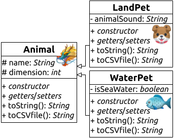

🤍

 
# 🐾 PetsList from CLI Response and Data Persistence 🐕🐟

## Objective:

Create a domestic pet management system with Java classes.
Utilize inheritance and an `ArrayList` to store a dynamic list of pets.
Implement a data persistence mechanism through a *CSV file*.

## Classes to Implement:

Refer to the following [Class Diagram](./PetsListClassDiagram.png)

### [`Animal`](./src/main/java/model/Animal.java):

- Base class representing an animal.
- Each animal has a `name: String` and `dimension: int`.
- The class should include a *constructor*, *getters/setters* methods, and a `toString()` method.
- Additionally, the class should include a `toCSVfile()` method that returns a string for saving instance variables to a **csv** file.

### [`LandPet`](./src/main/java/model/LandPet.java):

- Extends the `Animal` class.
- Represents a terrestrial domestic pet (**e.g.**: *dog* 🐕, *cat* 🐈).
- Adds a specific attribute, the sound it makes (`animalSound: String` 🙊🔊).
- Should include a *constructor*, *getters/setters* methods, a `toString()` method, and override the `toCSVfile()` method specific to the class.

### [`WaterPet`](./src/main/java/model/WaterPet.java):

- Extends the `Animal` class.
- Represents an aquatic domestic pet (**e.g.**: *goldfish* 🐠 or marine animals 🦀 🦑 🦞).
- Adds a specific attribute, a boolean indicating whether it belongs to a freshwater or saltwater species (`isSeaWater`).
- Should include a *constructor*, *getters/setters* methods, a `toString()` method, and override the `toCSVfile()` method specific to the class.

## CSVManager:

- In the [`main` file](./src/main/java/test/Main.java) is needed to handle reading and writing the *CSV file*.
- At program startup, check if a *CSV file* exists; if so, read animals from the file and add them to `ArrayList<Animal> pets`.
- Use a `while` loop to allow the user to add more animals through CLI input as long as they desire.
- Within the loop, ask the user to specify whether to add a terrestrial, aquatic, or a generic animal.
- Ask for the animal's name and specific attributes based on the type of animal.
- Add the animal to `ArrayList<Animal> pets`.
- Upon program termination, write the updated list of animals to the *CSV file*.

Every story of friendship between humans and animals deserves to be preserved, which is why *we read and write the list to the file*! 📜

## Conclusions

Are you ready to create an even more extraordinary world of domestic pets?

We've just started painting the canvas, but your personal touch can turn this project into a masterpiece!

*Good luck, and may your code always be clean and full of magic*! 👨‍💻🐾

 🤍 

 
# 🐾 PetsList from CLI Response and Data Persistence 🐕🐟

## Obiettivo:

Creare un sistema di gestione di animali domestici con classi in Java.
Utilizzare ereditarietà e un'`ArrayList` per memorizzare una lista dinamica di animali.
Implementare anche un meccanismo di persistenza dei dati tramite un *file CSV*.

## Classi da Implementare:

Fare riferimento al seguente [Class Diagram](./PetsLisClassDiagram.png)

### [`Animal`](./src/main/java/model/Animal.java):

- Classe base rappresentante un animale.
- Ogni animale ha un nome (`name: String`), e una dimensione (`dimension: int`)
- La classe deve prevedere un *costruttore*, dei metodi *getters/setters* e un metodo `toString()`
- La classe deve inoltre prevedere un metodo `toCSVfile()` che restituisce una stringa che verrà usata per il salvataggio nel file **csv** delle variabili di istanza.

### [`LandPet`](./src/main/java/model/LandPet.java):

- Estende la classe `Animal`.
- Rappresenta un animale domestico terrestre (**es**: *cane* 🐕, *gatto* 🐈).
- Aggiungi come attributo specifico il verso (`animalSound: String` 🙊🔊).
- Deve prevedere il *costruttore*, i *getters/setters*, il `toString()` e sovrascrivere il metodo `toCSVfile()` specifico per la classe.

### [`WaterPet`](./src/main/java/model/WaterPet.java):

- Estende la classe `Animal`.
- Rappresenta un animale domestico acquatico (**es**: *pesce rosso* 🐠 o *animali marini* 🦀 🦑 🦞).
- Aggiungi come attributo specifico un booleano per indicare se appartiene ad una specie di acqua dolce (*fresh water*) o salata (*sea water*) (`isSeaWater`).
- Deve prevedere il *costruttore*, i *getters/setters*, il `toString()` e sovrascrivere il metodo `toCSVfile()` specifico per la classe.

## CSVManager:

- Nel [`main` file](./src/main/java/test/Main.java) bisogna prevedere del codice per gestire la lettura e la scrittura del *file CSV*.
- All'avvio del programma, controllare se esiste un *file CSV*; in tal caso leggere gli animali dal file e aggiungili a `ArrayList<Animal> pets`.
- Utilizza un ciclo `while` per permettere all'utente di poter ulteriormente aggiungere altri animali mediante input da CLI fintanto che lo desidera.
- All'interno del ciclo, bisogna chiedere all'utente di specificare se vuole aggiungere un animale terrestre o acquatico o un generico animale.
- Chiedi il nome dell'animale e gli attributi specifici in base al tipo di animale.
- Aggiungi l'animale a `ArrayList<Animal> pets`.
- Allo spegnimento, scriviamo la lista aggiornata di animali nel *file CSV*.

Ogni storia di amicizia tra gli uomoni e animali merita di essere conservata ed è per questo che *leggiamo e scriviamo la lista nel file*! 📜

## Conclusioni

Siete pronti a creare un mondo di animali domestici ancora più straordinario?

Abbiamo appena iniziato a dipingere il quadro, ma il vostro tocco personale può trasformare questo progetto in un capolavoro!

*In bocca al lupo e che il vostro codice sia sempre pulito e pieno di magia*! 👨‍💻🐾

<a href="#TOP">&utrif; top &utrif;</a>

## 🔗 Links

