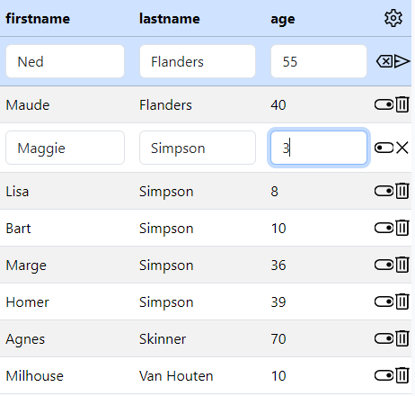

🤍

 
# Person CRUD Management in Java 🚀✨

## Mission 🌐

This repository is an exciting adventure in the world of creating RESTful services in Java, exploring the potential of **Java** ☕, [**Tomcat**](https://tomcat.apache.org/) 😺, [**SpringBoot**](https://start.spring.io) 🍃, DBMS 🛢️, and much more!

## 🌟 Repository Features

This code allows the management of a list of people represented by the class `class Person(id, firstname, lastname, age)` 👤 in **Java** ☕ using different approaches that will be illustrated below.

### A Single Car 🚗 with Different Engines

Imagine these approaches are like a car 🚗, and we can change the engine to use a different one, such as *gasoline* ⛽, *diesel* 🦕, *electric* ⚡, and even *hydrogen* 💧.
The body remains the same, but we can choose the engine that best suits our needs.

Each engine has a unique operation and different size, but there's a trick: each engine fits perfectly, like pieces of a puzzle. 🧩✨

Every approach follows a different path, yet each approach responds to a specific *route*, a particular **endpoint**, `/api/person`.

### 🎨 Captivating User Interface

👀 Interestingly, this approach allowed decoupling the *frontend* from the *backend*, so the *frontend* 🎭 practically remained unchanged for all versions, while the main changes focused on the *backend*!

Therefore, regardless of the technology used, a charming *web graphical interface* (called **Web UI** or **WUI**) developed with HTML, CSS, and JavaScript will welcome the user, displaying people in a tabular form and allowing various **CRUD operations** with great style and elegance 🎨, thanks to the magic of [Bootstrap](https://getbootstrap.com/) making the **WUI** more appealing 🖌️.

## 🌐 REST Architecture: CRUD Services and DBMS Operations

The **REST** architecture *(**Re**presentational **S**tate **T**ransfer)* is an architecture for designing distributed systems as web services.
This approach emphasizes resource representation and stateless interaction between the client and server.

**REST** uses standard HTTP methods to perform operations **CRUD** *(**C**reate **R**ead **U**pdate **D**elete)* usually on resources stored in databases 🛢️.

**What HTTP methods does ReST use, and what CRUD operations do they correspond to?**

* ➕ **POST** 🌱: to *create* a resource; corresponds to **C**reate **CRUD**, equivalent to an `INSERT` **SQL** operation 🛢️.
* 🔍 **GET** 📖: to *retrieve/read* a resource; corresponds to **R**ead **CRUD**, similar to a `SELECT` **SQL** operation 🛢️.
* 🔄 **PUT** ♻️: to *update* a resource; corresponds to **U**pdate **CRUD**, similar to an `UPDATE` **SQL** operation 🛢️.
* ❌ **DELETE** 🗑️: to *delete* a resource; corresponds to **D**elete **CRUD**, equivalent to a `DELETE` **SQL** operation 🛢️.

These HTTP methods correspond to the operations **CRUD**, playing a crucial role in our example, allowing users to interact with our API fully and securely. 🔗

### 😺 [ver 0.9](./v0.9-ALPHA_tomcat_complete_crud): Servlet and Tomcat 😺

In the first version, we leverage **servlets** to handle HTTP requests.
Servlets respond along the `/api/person` route by returning JSON and HTTP status messages to inform the user.

The servlet [`PersonRouter.java`](v0.9-ALPHA_tomcat_complete_crud/src/main/java/routers/PersonRouter.java) is nothing more than a special class that extends `HttpServlet` and overrides the following methods:

* 🔍 **doGet(…)** for 👁️ *viewing people*; if an `id` is sent, it shows a specific 👤 person from the list; otherwise, it displays the complete list of people 👥 in *JSON format*.
* 🌱 **doPost(…)** for ➕ *adding a person*; an HTTP message will inform whether the insertion was successful or not in the manager.
* **doPut(…)** for ✏️ *modifying a person* by updating different fields; an HTTP message will inform whether the operation was successful or not.
* **doDelete(…)** for ❌ *deleting a person* from the list; an HTTP message will inform whether the operation was successful or not.

This approach leaves a significant burden on the programmer, who must write a lot of code to handle different events.
In this approach, no persistence has been implemented, so no DBMS 🛢️ is used.
A simple `ArrayList<Person> people` is used, so changes will be lost every time the application is restarted.

### 🚀 [ver 1.0](./v1.0-spring_arraylist/): SpringBoot 🍃

With the transition to **SpringBoot** 🍃, our code becomes much leaner. **SpringBoot** 🍃 simplifies configuration and provides a more structured environment for creating **Java** ☕ applications.
Here, we continue to implement [**CRUD**](./v1.0-spring_arraylist/src/main/java/pkg/router/PersonRouter.java) operations, but with greater efficiency thanks to the features of **SpringBoot** 🍃 that handle many low-level details.
You will notice a significant reduction in the necessary code compared to the implementation with servlets alone. 🌱

### 🌐 [ver 2.0](./v2.0-spring_jpa/): Persistence with H2DB 🛢️

The final version adds *data persistence* using [**H2DB**](https://www.h2database.com/) as a database.
Here, we introduce the concept of *Object-Relational Mapping* (**ORM**) through **JPA** (*Java Persistence API*) and [**Hibernate**](https://hibernate.org).
Now, working with data in SQL will be as simple as working with an [`ArrayList`](./v2.0-spring_jpa/src/main/java/pkg/router/PersonRouter.java) in **Java** ☕, and changes persist even after restarts thanks to database persistence.
**SpringBoot** 🍃, along with **JPA** and **Hibernate**, significantly simplifies interaction with the database. 🗃️

📢 **Announcement**

🛢️ The decision to use **H2DB** was driven by its convenience, but we could have chosen any DBMS supported by **SpringBoot** 🍃.
**H2DB** is particularly suitable for prototyping and integrates well with **SpringBoot** 🍃.
Similar to [phpMyAdmin](https://www.phpmyadmin.net) for PHP, it provides a minimal web interface accessible at [http://localhost:3000/h2-console/](http://localhost:3000/h2-console/).
The required credentials can be found in the [application.properties](./v2.0-spring_jpa/src/main/resources/application.properties) file.
Additionally, you need to input the absolute disk address of the `PeopleDB.mv.db` file preceded by `jdbc:h2` in the **JDBC URL** section.

📡 **Note**: Remember that the `\` characters must be replaced with `\\`!

## 🤝 Lessons Learned

This experiment has taught us to **decouple the frontend from the backend**, understand the importance of data persistence, and evolve toward a data-oriented architecture.
The use of DBMS is crucial, and the flexibility of JPA easily allows changing DBMS in the future. 🚀

## 🚀 Contribute and Have Fun!

Contribute, explore, learn, and enjoy the process of creating *RESTful* services in Java. 🤓✨

 🤍 

 
# Person CRUD Management in Java 🚀✨

## Mission 🌐

Questo repository è un'avventura entusiasmante nell'universo della creazione di servizi RESTful in Java, esplorando le potenzialità di **Java** ☕, [**Tomcat**](https://tomcat.apache.org/) 😺, [**SpringBoot**](https://start.spring.io) 🍃, DBMS 🛢️ e molto altro!

## 🌟 Funzionalità del Repository

Questo codice permette la gestione di una lista di persone rappresentate dalla classe `class **Person**(*id*, *firstname*, *lastname*, *age*)` 👤 in **Java** ☕ usando diversi approcci che di seguito verranno illustrati.

#### Una stessa macchima 🚗 ma con diversi motori

Immagina che questi approcci siano come una macchina 🚗, la quale possiamo cambiare il motore in modo da usarne uno diverso, come *benzina* ⛽, *diesel* 🦕, *elettrico* ⚡, e persino ad *idrogeno* 💧.

La carrozzeria rimane invariata, ma possiamo scegliere il motore che meglio si adatta alle nostre esigenze.
Ogni motore ha un funzionamento unico e una diversa grandezza ma si incastra perfettamente, come ai diversi incastri. 🧩✨

Ogni approccio persegue una strada diversa, ciononostate ogni approccio risponde su un determinata *rotta*, uno specifico **endpoint**, ovvero `/api/person`.

### 🎨 Interfaccia Utente Affascinante

👀 È interessante notare che questo approccio ha permesso di scorrelare il *frontend* dal *backend*, di conseguenza la parte di *frontend* 🎭 è rimasta praticamente invariata uguale per tutte le versioni, mentre le uniche modifiche principali si sono concentrate nel *backend*!

Quindi a dispetto della tecnologia adoperata una simpatica *interfaccia grafica web* (detta **Web UI** o **WUI**) sviluppata con HTML, CSS e JavaScript con accoglierà l'utente mostrando in forma tabellare le persone contenute nella lista e permettendo di effettuare le diverse **operazioni CRUD** con gran stile ed eleganza 🎨 grazie all'uso della magia di [Bootstrap](https://getbootstrap.com/) che rende la **WUI** più accattivante 🖌️

## 🌐 Architettura ReST: Servizi CRUD e Operazioni su DBMS

L'architettura **REST** *(**Re**presentational **S**tate **T**ransfer)* è un'architettura per la progettazione di sistemi distribuiti come servizi web.
Questo approccio mette l'accento sulla rappresentazione delle risorse e sull'interazione senza stato tra client e server.

**REST** utilizza i metodi standard del protocollo **HTTP** per eseguire operazioni **CRUD** *(**C**reate **R**ead **U**pdate **D**elete)* solitamente su risorse conservate nei DB 🛢️.

**Quali sono i metodi HTTP usati nel ReST e a quali operazioni corrispondono?**

* ➕ **POST** 🌱: per *creare* una risorsa; corrisponde al **C**reate **CRUD**, equivalente a un'operazione di `INSERT` **SQL** 🛢️.
* 🔍 **GET** 📖: per *ottenere/leggere* una risorsa; corrisponde al **R**ead **CRUD**, simile a un'operazione di `SELECT` **SQL** 🛢️.
* 🔄 **PUT** ♻️: per *aggiornare* una risorsa; corrisponde al **U**pdate **CRUD**, simile a un'operazione `UPDATE` **SQL** 🛢️.
* ❌ **DELETE** 🗑️: per *eliminare* una risorsa; corrisponde al **D**elete **CRUD**, equivalente a un'operazione `DELETE` **SQL** 🛢️.

Questi metodi HTTP corrispondono alle operazioni **CRUD**, svolgendo un ruolo chiave nel nostro esempio, consentendo agli utenti di interagire con la nostra API in modo completo e sicuro. 🔗

### 😺 [ver 0.9](./v0.9-ALPHA_tomcat_complete_crud): Servlet and Tomcat 😺

Nella prima versione, sfruttiamo le **servlet** per gestire le richieste **HTTP**.
Le servlet rispondendo totto la rotta `/api/person` restituiscono JSON e messaggi di Status HTTP per informare l'utente.
La servlet [`PersonRouter.java`](v0.9-ALPHA_tomcat_complete_crud/src/main/java/routers/PersonRouter.java) altro non è che una speciale classe che estende `HttpServlet`, ed effettua l'overlad dei seguenti metodi:
* 🔍 **doGet(…)** per 👁️ *visualizzazione delle persone*; se viene spedito anche l'`id` mostra una persona specifica 👤 della lista altrimenti mostra la lista completa 👥 in *formato JSON*.
* 🌱 **doPost(…)** per ➕ *aggiungere una persona*, un simpatico messaggio di *HTTP* informerà se l'inserimento è o meno andato a buon fine nel gestionale.
* **doPut(…)** per ✏️ *modificare una persona* aggiornando i diversi campi; un messaggio *HTTP* informerà se l'operazione si è o meno conclusa con successo.
* **doDelete(…)** per ❌ *l'eliminazione di una persona** dalla lista; un messaggio *HTTP* informerà se l'operazione si è o meno conclusa con successo.

Questo approccio lascia un grande onere al programmatore che deve scrivere molto codice per gestire i diversi eventi.
In questo approccio non è stata implementata la persistenza quindi non si fa uso di nessun DBMS 🛢️, è stato usaot un semplice `ArrayList<Person> people`, di conseguenza ad ogni riavvio dell'applicazione le modifiche andranno perse

### 🚀 [ver 1.0](./v1.0-spring_arraylist/): SpringBoot 🍃

Con la transizione a **SpringBoot** 🍃, il nostro codice si snellisce notevolmente.
**SpringBoot** 🍃 semplifica la configurazione e offre un ambiente più strutturato per la creazione di applicazioni **Java** ☕.
Qui, continuiamo a implementare le operazioni [**CRUD**](./v1.0-spring_arraylist/src/main/java/pkg/router/PersonRouter.java), ma con una maggiore efficienza grazie alle funzionalità di **SpringBoot** 🍃 che gestiscono molti dettagli di basso livello.
Noterai una riduzione significativa del codice necessario rispetto all'implementazione con le sole servlet. 🌱

### 🌐 [ver 2.0](./v2.0-spring_jpa/): Persistenza con H2DB 🛢️

La versione finale aggiunge la *persistenza dei dati* utilizzando [**H2DB**](https://www.h2database.com/) come database.
Qui, introduciamo il concetto di *Object-Relational Mapping* (**ORM**) attraverso **JPA** (*Java Persistence API*)* e [**Hibernate**](https://hibernate.org).
Ora, operare sui dati in sql sarà semplice come operare su un [`ArrayList`](./v2.0-spring_jpa/src/main/java/pkg/router/PersonRouter.java) in **Java** ☕ e le modifiche persistono anche dopo i riavvii grazie alla persistenza del database.
**SpringBoot** 🍃, insieme a **JPA** e **Hibernate**, semplifica notevolmente l'interazione con il database. 🗃️

📢 **Announcement**

🛢️ La decisione di utilizzare **H2DB** è stata motivata dalla sua praticità, ma avremmo potuto scegliere qualsiasi DBMS supportato da **SpringBoot** 🍃.
**H2DB** è particolarmente adatto per la creazione di prototipi e si integra bene con **SpringBoot** 🍃.
Simile a [phpMyAdmin](https://www.phpmyadmin.net) per PHP, offre un'interfaccia web minimale accessibile all'indirizzo [http://localhost:3000/h2-console/](http://localhost:3000/h2-console/).
Le credenziali necessarie sono disponibili nel file [application.properties](./v2.0-spring_jpa/src/main/resources/application.properties).
Inoltre, è necessario inserire l'indirizzo assoluto sul disco del file `PeopleDB.mv.db` preceduto da `jdbc:h2` nella sezione **JDBC URL**.

📡 **Nota**: Ricorda che i caratteri `\` devono essere sostituiti con `\\`!

## 🤝 Lezioni Apprese

Questo esperimento ha insegnato a **dissociare il frontend dal backend**, comprendere l'importanza della persistenza dei dati e l'evoluzione verso un'architettura orientata ai dati.
L'uso del DBMS è cruciale e la flessibilità di JPA permette facilmente di cambiare DBMS in futuro. 🚀

## 🚀 Contribuisci e Divertiti!

Contribuisci, esplora, impara e goditi il processo di creazione di servizi *RESTful* in Java. 🤓✨

<a href="#TOP">&utrif; top &utrif;</a>

## 🔗 Links

