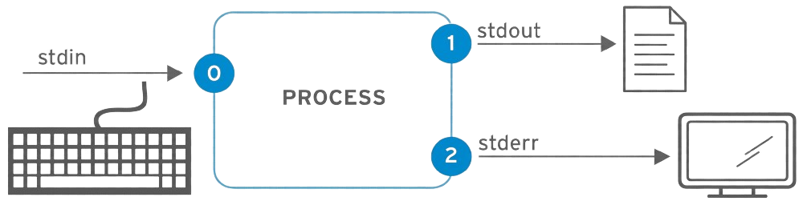

[](https://choosealicense.com/licenses/mit/)
[](https://opensource.org/licenses/)
[](http://www.gnu.org/licenses/agpl-3.0)

<a name="TOP"></a>

<a href="#IT"></a>
🤍
<a href="#EN"></a>

---

 <a name="EN"></A>

<!-- English -->

# ☕🚀 Java Under the Hood: From Keyboard Input to Command-Line Arguments

### Java Does Not Live Inside Eclipse

When we program in Java, it's easy to feel like **Eclipse does everything**: we write the code, press ▶️, and suddenly the program starts running.

But Eclipse is just a tool that helps us work.

Under the hood, Java keeps doing its job: organizing classes, using libraries, receiving data, producing output, compiling source code and, when needed, receiving information directly from the command line.

The two examples in this guide, available here:

* [`es01/Main.java`](./es01/Main.java)
* [`es02/Main.java`](./es02/Main.java)

are small, but they pack quite a few important concepts.

The first program lets us explore **keyboard input**, `Scanner`, **output**, and **loops**.

The second takes a different approach: instead of asking the user for data while it runs, it receives information **right when the program starts**, through what are called **command-line arguments**.

This is where we start seeing what really happens *"under the hood"* in Java. 🔧

## 1. 📦 Packages and imports: keeping the Java world organized

At the start of the first program we find:

```java
package es01;
```

A **package** is a way to organize Java classes.
Think of it as a logical folder where we group classes that belong to the same project or the same part of a project.
In our case, we have:

```text
progetto/
├── es01/
│	└── Main.java
└── es02/
	└── Main.java
```

The [`Main.java`](./es01/Main.java) file inside the `es01` folder therefore belongs to the package:

```java
package es01;
```

This also means that the class's full name is not simply `Main`, but `es01.Main`.

The same idea applies to the second example, which belongs to the `es02` package:

```java
package es02;
```

### Why is this useful?

Imagine having ten classes called `Main`. Without some way to organize them, things would get pretty messy.

With packages, we can happily have:

```text
es01.Main
es02.Main
es03.Main
```

They are different classes because they belong to different packages.

> 💡 **Key idea:** a package is mainly used to **organize and identify Java classes**.

## 2. 📚 Imports: "Java, I need this library!"

In the first example we find:

```java
import java.util.Scanner;
```

Here we meet another key concept: **importing a class from the Java libraries**.
Java gives us a huge collection of ready-made classes. Luckily, we don't have to reinvent the wheel every time. 🚲
`Scanner`, for example, is a class that belongs to the `java.util` package.

The line:

```java
import java.util.Scanner;
```

basically says:

> "In my program, I want to use the `Scanner` class from the `java.util` package."

So we can simply use:

```java
Scanner
```

instead of writing every time:

```java
java.util.Scanner
```

### Packages and imports are not the same thing

It's important not to mix them up:

| Element | Purpose |
| ---: | --- |
| `package es01;` | defines which package our class belongs to |
| `import java.util.Scanner;` | lets us use a class from another package by its short name |

The package **organizes our class**.

The import **makes it easier to use a class we need**.

## 3. ⌨️ Keyboard input: `Scanner` enters the scene

Now we get to our first real star:

```java
Scanner scan = new Scanner(System.in);
```

This statement creates a `Scanner` object connected to:

```java
System.in
```

#### So, what is `System.in`?

Java provides a few **standard streams**, which are channels through which the program communicates with the outside world.

The three main ones are:

| Stream | Name | code | Meaning | Use |
| ---: | :---: | :--- | --- | --- |
| `System.in` | STD_IN | 0 | Standard Input | data coming into the program |
| `System.out` | STD_OUT | 1 | Standard Output | normal output produced by the program |
| `System.err` | STD_ERR | 2 | Standard Error | error messages |

We can picture them like this:



When we type on the keyboard, the characters are sent to **standard input**, and `Scanner` lets us read that data pretty easily.

## 4. 🔍 `Scanner`: reading different kinds of data

In our example, we use several `Scanner` methods.

### `nextLine()`

```java
String nome = scan.nextLine();
```

It reads **a whole line**, up to the moment you press Enter.

If the user types:

```text
Mario Rossi
```

the result will be:

```text
" Mario Rossi "
```

conceptually, meaning the whole sequence of characters entered on that line.

### `next()`

```java
String parola = scan.next();
```

It reads the **next token**, usually separated by spaces.

If the user types `Mario Rossi`, the first call to `next()` returns `Mario`; the second would return `Rossi`.

### `nextInt()`

In our program we find:

```java
int n = scan.nextInt();
```

It reads the next value and treats it as an **integer**.

### `nextDouble()`

There is also:

```java
double valore = scan.nextDouble();
```

which lets us read a floating-point number.

In short:

| Method | Reads | Example |
| --- | --- | --- |
| `next()` | a token | `Mario` |
| `nextLine()` | a whole line | `Mario Rossi` |
| `nextInt()` | an integer | `15` |
| `nextDouble()` | a floating-point number | `12.5` |

#### ⚠️ Watch out:
`nextLine()` and `next()` are not simply two versions of the same method.
The first works in terms of **lines**, the second in terms of **tokens**.

## 5. 🧹 Why use `.strip()` after `nextLine()`?

In the first example we find:

```java
String nome = scan.nextLine().strip();
```

Two operations happen here, one after the other.

First:

```java
scan.nextLine()
```

it reads the line entered by the user.

Then:

```java
.strip()
```

it removes any whitespace that may be **at the beginning or end** of the string.

For example, if the user accidentally typed:

```text
	Mario Rossi
```

the value after `strip()` would be:

```text
Mario Rossi
```

This is especially handy with `nextLine()`, because the method reads **the whole line**, including any spaces the user may have typed.

So we can think of it like this:

```text
nextLine()
	↓
"    Mario Rossi    "
	↓
strip()
	↓
"Mario Rossi"
```

We are not changing the content inside the sentence; we're simply removing the "noise" around the edges.


## 6. 🔁 The `for` loop and `foreach`

The first example contains a regular `for` loop:

```java
for (int i = 0; i < n; i++) {
	...
}
```

This is useful when we need a **counter**.

The second program, on the other hand, contains:

```java
for (String arg : args) {
	...
}
```

This is the **foreach**, a kind of loop designed to go through the elements of a data structure.

In this case, `args` is an array of strings.

The idea is basically:

> "For each element in `args`, temporarily put it in the `arg` variable and run the block."

So, if we have:

```java
String[] args = ["ciao", "Java", "2026"]
```

the loop will run the block three times, with:

```text
arg = "ciao"
arg = "Java"
arg = "2026"
```

The **foreach** is especially handy when **we don't care about the element's index**, and only want to process the elements one after another.

## 7. 🖨️ Output: `System.out` and `printf()`

In the first program we find:

```java
System.out.print("Enter your name: ");
```

and:

```java
System.out.println("Thanks for using our software....");
```

Both use **standard output**.

The main difference is that `println()` adds a new line after the text, while `print()` does not.

Then we have:

```java
System.out.printf(...);
```

`printf()` lets us produce **formatted** output.

Our example uses `%02d`.
Basically, `%02d` means we want to print an integer (`d`) using at least two digits (`2`), adding a leading `0` when needed (`0`).

This gives us:

```text
01. Mario
02. Mario
03. Mario
```

instead of:

```text
1. Mario
2. Mario
3. Mario
```

It's a small detail, but it shows an important Java feature: **you can control the format of the output**, not just its content.

## 8. 📝 Multiline strings

The second example contains something interesting:

```java
System.err.print(
	"""
	ERRORE:
	Non sono stati passati parametri...
	"""
);
```

The three quotation marks:

```java
"""
```

introduce a **text block**, a string that can be written across multiple lines while keeping a shape very close to what will appear in the output.

This is especially useful when we need to print:

* long messages;
* text spanning multiple lines;
* error messages;
* configurations or blocks of text.

Instead of building a string by joining lots of pieces together, we can write it directly in the shape we want.

The result is much easier to read in the source code too.

# 9. 🛠️ From a `.java` file to a running program

So far we've used Eclipse, but what actually happens when we run a Java program?

Our source code is in: `Main.java`
The Java compiler, through `javac`, turns the source code into **bytecode**:

```text
Main.java
	│
	│	javac
	↓
Main.class
```

The `.class` file contains the bytecode that will be run by the **Java Virtual Machine**, the JVM.

In our case, since the class belongs to the `es02` package, we can compile it and then run it from the terminal, roughly like this:

```bash
javac -d . Main.java
java es02.Main
```

The package matters here: the name of the class we run becomes `es02.Main`, not simply `Main`.
At this stage, we don't need to dive into the internals of bytecode or the JVM.

For now, it's enough to remember this path:

```text
CODICE SORGENTE
		│
		│ javac
		↓
	BYTECODE
		│
		│ JVM
		↓
PROGRAMMA IN ESECUZIONE
```

Of course, Eclipse does most of this work for us automatically.

## 10. 🚀 A different way to give information to the program

In the first example, the program starts and then asks: `Enter your name:`
So the user **interacts with the program while it is running**.
In the second example, `Scanner` is not used.

The `main` method is declared like this:

```java
public static void main(String[] args)
```

That parameter:

```java
String[] args
```

is an **array of strings containing the arguments passed to the program when it starts**.

For example, imagine running:

```bash
java es02.Main Mario Rossi 4
```

The program receives the arguments as strings:

```text
args[0] → "Mario"
args[1] → "Rossi"
args[2] → "4"
```

Here is a key difference:

```text
Scanner
	↓
legge dati durante l'esecuzione
	↓
System.in

args[]
	↓
riceve dati quando il programma viene avviato
	↓
parametri della linea di comando
```

The arguments also arrive as **strings**.
If `4` needs to be used as a number, it has to be converted.

## 11. 🖥️ So how do we pass arguments in Eclipse?

And that brings up the obvious question:

> "If I use Eclipse, where do I find the command line?"

We don't necessarily have to open a terminal.
Eclipse lets us configure the arguments passed to the program through the run configuration.

In general:

```text
Run
	↓
Run Configurations...
	↓
Java Application
	↓
selezionare il programma
	↓
Arguments
```

In the **Program arguments** field, we can enter, for example, `Mario Rossi 4`.
When Eclipse starts the program, it is as if we had typed those arguments on the command line.

Our `main()` method will then receive them inside:

```java
args
```

This is an important concept:

> **Eclipse does not change how Java works. It simply gives us a graphical interface for configuring things we could also do from the terminal.**


## 12. 🚨 `System.err`: when output is an error

In the second program we see:

```java
System.err.print(...);
```

We do not use:

```java
System.out
```

but:

```java
System.err
```

#### Why?

Because the program is reporting an **error condition**: *no arguments were provided*.

`System.err` represents **standard error**, a stream separate from standard output.

So we can sum it up like this:

```text
System.in
	→ dati che entrano

System.out
	→ normale comunicazione in uscita

System.err
	→ messaggi di errore
```

In Eclipse and regular terminals, we can often see `System.out` and `System.err` in the same area of the screen.
That does not mean they are the same stream.

They are separate channels and, in more advanced setups, they can be handled or redirected independently.

> 💡 **Fun fact:** separating normal output from errors lets the tools running the program tell normal communication apart from things the program is reporting as errors.

## 13. 🎯 Two programs, two ways to communicate

Our two examples look very simple, but they actually let us see two fundamental ways a program communicates with the outside world.

In the first:

```text
utente
	│
	│ tastiera
	↓
System.in
	↓
Scanner
	↓
programma
	↓
System.out
	↓
schermo
```

In the second:

```text
linea di comando
	│
	↓
args[]
	│
	↓
programma
	│
	├──→ System.out
	│
	└──→ System.err
```

We also saw that Java organizes its classes through **packages**, uses `import` to conveniently access library classes, provides different `Scanner` methods for reading different kinds of data, and makes it easy to represent multiline strings.

And we also took a quick trip behind the scenes:

```text
.java
	↓
javac
	↓
.class
	↓
JVM
	↓
programma
```

So next time we press Eclipse's ▶️ button, we can remember that **there's no magic in that button**.
Behind that green arrow is a whole mechanism: compilation, bytecode, the JVM, classes, packages, input, output, and arguments.
And now we can start looking at Java not just as a language for "writing programs", but as an environment where **our program is constantly communicating with the outside world**. 🚀


---

<a href="#IT"></a>
🤍
<a href="#EN"></a>

---

 <a name="IT"></A>

<!-- Italiano -->

# ☕🚀 Java Under the Hood: From Keyboard Input to Command-Line Arguments

### Java non vive dentro Eclipse

Quando programmiamo in Java, è facile avere l'impressione che **Eclipse faccia tutto**: scriviamo il codice, premiamo ▶️ e improvvisamente il programma parte.

Ma Eclipse è solo uno strumento che ci aiuta a lavorare.

Sotto la superficie, Java continua a fare il suo lavoro: organizza le classi, utilizza librerie, riceve dati, produce output, compila il codice sorgente e, quando necessario, riceve informazioni direttamente dalla linea di comando.

I due esempi di questa guida, disponibili rispettivamente in:

* [`es01/Main.java`](./es01/Main.java)
* [`es02/Main.java`](./es02/Main.java)

sono piccoli, ma contengono parecchi concetti importanti.

Il primo programma ci permette di esplorare **input da tastiera**, `Scanner`, **output** e **cicli**.

Il secondo cambia prospettiva: invece di chiedere dati all'utente durante l'esecuzione, riceve informazioni **direttamente all'avvio del programma**, attraverso i cosiddetti **parametri della linea di comando**.

È proprio qui che iniziamo a vedere cosa succede davvero *"sotto il cofano"* di Java. 🔧

## 1. 📦 Package e import: mettere ordine nel mondo Java

All'inizio del primo programma troviamo:

```java
package es01;
```

Il **package** è un modo per organizzare le classi Java.
Possiamo immaginarlo come una cartella logica nella quale raccogliere classi appartenenti allo stesso progetto o alla stessa parte del progetto.
Nel nostro caso abbiamo:

```text
progetto/
├── es01/
│	└── Main.java
└── es02/
	└── Main.java
```

Il file [`Main.java`](./es01/Main.java) contenuto nella cartella `es01` appartiene quindi al package:

```java
package es01;
```

Questo significa anche che il nome completo della classe non è semplicemente `Main` ma `es01.Main`

Lo stesso principio vale per il secondo esempio, che appartiene al package `es02`:

```java
package es02;
```

### Perché è utile?

Immaginiamo di avere dieci classi chiamate `Main`. Senza un sistema di organizzazione, sarebbe un bel pasticcio.

Con i package possiamo avere tranquillamente:

```text
es01.Main
es02.Main
es03.Main
```

Sono classi diverse perché appartengono a package diversi.

> 💡 **Idea da ricordare:** il package serve principalmente a **organizzare e identificare le classi Java**.

## 2. 📚 Import: "Java, mi serve questa libreria!"

Nel primo esempio troviamo:

```java
import java.util.Scanner;
```

Qui compare un altro concetto fondamentale: **l'importazione di una classe che appartiene alle librerie Java**.
Java mette a disposizione una grande quantità di classi già pronte. Non dobbiamo reinventare ogni volta la ruota, per fortuna. 🚲
`Scanner`, per esempio, è una classe appartenente al package: `java.util`

La riga:

```java
import java.util.Scanner;
```

dice sostanzialmente:

> "Nel mio programma voglio utilizzare la classe `Scanner` che si trova nel package `java.util`."

Possiamo quindi utilizzare direttamente:

```java
Scanner
```

anziché scrivere ogni volta:

```java
java.util.Scanner
```

### Package e import non sono la stessa cosa

È importante non confonderli:

| Elemento | Funzione |
| ---: | --- |
| `package es01;` | stabilisce a quale package appartiene la nostra classe |
| `import java.util.Scanner;` | permette di utilizzare una classe di un altro package con il suo nome breve |

Il package **organizza la nostra classe**.

L'import **rende più comodo utilizzare una classe che ci serve**.

## 3. ⌨️ Input da tastiera: entra in scena `Scanner`

Arriviamo al primo vero protagonista:

```java
Scanner scan = new Scanner(System.in);
```

Questa istruzione crea un oggetto `Scanner` collegato a:

```java
System.in
```

#### Ma che cos'è `System.in`?

Java mette a disposizione alcuni **flussi standard**, cioè canali attraverso i quali il programma comunica con l'ambiente esterno.

I tre principali sono:

| Flusso | Nome | code | Significato | Utilizzo |
| ---: | :---: | :--- | --- | --- |
| `System.in` | STD_IN | 0 | Standard Input | dati che entrano nel programma |
| `System.out` | STD_OUT | 1 | Standard Output | normale output prodotto dal programma |
| `System.err` | STD_ERR | 2 | Standard Error | messaggi di errore |

Possiamo visualizzarli così:


Quando scriviamo sulla tastiera, i caratteri vengono inviati allo **standard input** e `Scanner` ci permette di leggere questi dati in maniera abbastanza semplice.

## 4. 🔍 `Scanner`: leggere dati diversi

Nel nostro esempio utilizziamo diversi metodi di `Scanner`.

### `nextLine()`

```java
String nome = scan.nextLine();
```

Legge **un'intera riga**, fino alla pressione di Invio.

Se l'utente scrive:

```text
Mario Rossi
```

il risultato sarà:

```text
" Mario Rossi "
```

concettualmente, cioè l'intera sequenza di caratteri inserita sulla riga.

### `next()`

```java
String parola = scan.next();
```

Legge il **prossimo token**, normalmente separato da spazi.

Se l'utente scrive: `Mario Rossi` la prima chiamata a `next()` restituisce: `Mario` la seconda restituirebbe: `Rossi`

### `nextInt()`

Nel nostro programma troviamo:

```java
int n = scan.nextInt();
```

Legge il prossimo valore interpretandolo come **numero intero**.

### `nextDouble()`

Esiste anche:

```java
double valore = scan.nextDouble();
```

che permette di leggere un numero reale.

In sintesi:

| Metodo | Legge | Esempio |
| --- | --- | --- |
| `next()` | un token | `Mario` |
| `nextLine()` | un'intera riga | `Mario Rossi` |
| `nextInt()` | un intero | `15` |
| `nextDouble()` | un reale | `12.5` |

#### ⚠️ Attenzione:
`nextLine()` e `next()` non sono semplicemente due versioni dello stesso metodo.
Il primo ragiona per **righe**, il secondo per **token**.

## 5. 🧹 Perché `.strip()` dopo `nextLine()`?

Nel primo esempio troviamo:

```java
String nome = scan.nextLine().strip();
```

Qui succedono due operazioni consecutive.

Prima:

```java
scan.nextLine()
```

legge la riga inserita dall'utente.

Poi:

```java
.strip()
```

rimuove gli spazi bianchi eventualmente presenti **all'inizio e alla fine** della stringa.

Per esempio, se l'utente inserisse accidentalmente:

```text
	Mario Rossi
```

il valore ottenuto dopo `strip()` sarebbe:

```text
Mario Rossi
```

La scelta è particolarmente sensata quando si usa `nextLine()`, perché questo metodo legge **tutta la riga**, compresi eventuali spazi che l'utente potrebbe aver digitato.

Possiamo quindi pensare:

```text
nextLine()
	↓
"    Mario Rossi    "
	↓
strip()
	↓
"Mario Rossi"
```

Non stiamo modificando il contenuto interno della frase: stiamo semplicemente eliminando il "rumore" ai bordi.


## 6. 🔁 Il `for` e il `foreach`

Nel primo esempio compare un normale ciclo `for`:

```java
for (int i = 0; i < n; i++) {
	...
}
```

Questo è utile quando abbiamo bisogno di un **contatore**.

Il secondo programma, invece, contiene:

```java
for (String arg : args) {
	...
}
```

Questo è il **foreach**, cioè una forma di ciclo pensata per attraversare gli elementi di una struttura dati.

In questo caso `args` è un array di stringhe.

Il significato è sostanzialmente:

> "Per ogni elemento contenuto in `args`, mettilo temporaneamente nella variabile `arg` ed esegui il blocco."

Quindi, se abbiamo:

```java
String[] args = ["ciao", "Java", "2026"]
```

il ciclo eseguirà tre volte il blocco, con:

```text
arg = "ciao"
arg = "Java"
arg = "2026"
```

Il **foreach** è particolarmente comodo quando **non ci interessa conoscere l'indice dell'elemento**, ma soltanto elaborare gli elementi uno dopo l'altro.

## 7. 🖨️ Output: `System.out` e `printf()`

Nel primo programma troviamo:

```java
System.out.print("Enter your name: ");
```

e:

```java
System.out.println("Thanks for using our software....");
```

Entrambi utilizzano lo **standard output**.

La differenza principale è che `println()` aggiunge una nuova riga dopo il testo, mentre `print()` no.

Abbiamo poi:

```java
System.out.printf(...);
```

`printf()` permette di produrre output **formattato**.

Nel nostro esempio viene utilizzato `%02d`.
In pratica `%02d` significa che vogliamo stampare un numero intero (`d`) utilizzando almeno due cifre (`2`), inserendo uno `0` davanti quando necessario (`0`).

Otteniamo così:

```text
01. Mario
02. Mario
03. Mario
```

anziché:

```text
1. Mario
2. Mario
3. Mario
```

È un dettaglio piccolo, ma mostra una caratteristica importante di Java: **l'output può essere controllato anche nel formato**, non soltanto nel contenuto.

## 8. 📝 Le stringhe multilinea

Nel secondo esempio compare qualcosa di interessante:

```java
System.err.print(
	"""
	ERRORE:
	Non sono stati passati parametri...
	"""
);
```

Le tre virgolette:

```java
"""
```

introducono un **text block**, cioè una stringa che può essere scritta su più righe mantenendo una forma molto simile a quella che apparirà nell'output.

Questo è particolarmente utile quando dobbiamo stampare:

* messaggi lunghi;
* testi su più righe;
* messaggi di errore;
* configurazioni o blocchi di testo.

Invece di costruire una stringa concatenando tanti pezzi, possiamo scriverla direttamente nella forma desiderata.

Il risultato è molto più leggibile anche nel codice sorgente.

# 9. 🛠️ Dal file `.java` al programma eseguito

Finora abbiamo utilizzato Eclipse, ma cosa succede realmente quando eseguiamo un programma Java?

Il nostro codice sorgente è contenuto in: `Main.java`
Il compilatore Java, attraverso `javac`, trasforma il codice sorgente in **bytecode**:

```text
Main.java
	│
	│	javac
	↓
Main.class
```

Il file `.class` contiene il bytecode che sarà eseguito dalla **Java Virtual Machine**, la JVM.

Nel nostro caso, poiché la classe appartiene al package `es02`, possiamo compilare e poi eseguire dal terminale, concettualmente, in questo modo:

```bash
javac -d . Main.java
java es02.Main
```

La presenza del package è importante: il nome della classe da eseguire diventa `es02.Main` e non semplicemente `Main`
Non ci interessa, in questa fase, entrare nei dettagli interni del bytecode o della JVM.

Ci basta fissare questo percorso:

```text
CODICE SORGENTE
		│
		│ javac
		↓
	BYTECODE
		│
		│ JVM
		↓
PROGRAMMA IN ESECUZIONE
```

Eclipse, naturalmente, fa automaticamente gran parte di questo lavoro per noi.

## 10. 🚀 Un modo diverso di dare informazioni al programma

Nel primo esempio il programma parte e poi chiede: `Enter your name:`
Quindi l'utente **interagisce con il programma durante l'esecuzione**.
Nel secondo esempio, invece, non viene utilizzato `Scanner`.

Il metodo `main` è dichiarato così:

```java
public static void main(String[] args)
```

Quel parametro:

```java
String[] args
```

è un **array di stringhe contenente gli argomenti passati al programma quando viene avviato**.

Per esempio, possiamo immaginare di eseguire:

```bash
java es02.Main Mario Rossi 4
```

Gli argomenti vengono ricevuti dal programma come stringhe:

```text
args[0] → "Mario"
args[1] → "Rossi"
args[2] → "4"
```

Ecco una differenza fondamentale:

```text
Scanner
	↓
legge dati durante l'esecuzione
	↓
System.in

args[]
	↓
riceve dati quando il programma viene avviato
	↓
parametri della linea di comando
```

Gli argomenti, inoltre, arrivano come **stringhe**.
Se `4` deve essere utilizzato come numero, sarà necessario convertirlo.

## 11. 🖥️ E in Eclipse come passiamo gli argomenti?

E qui arriva la domanda naturale:

> "Se uso Eclipse, dove trovo la linea di comando?"

Non dobbiamo necessariamente aprire un terminale.
Eclipse permette di configurare gli argomenti da passare al programma attraverso la configurazione di esecuzione.

In linea generale:

```text
Run
	↓
Run Configurations...
	↓
Java Application
	↓
selezionare il programma
	↓
Arguments
```

Nel campo **Program arguments** possiamo inserire, per esempio `Mario Rossi 4`
Quando Eclipse avvierà il programma, sarà come se avessimo scritto quegli argomenti nella linea di comando.

Il nostro `main()` li riceverà quindi dentro:

```java
args
```

Questo è un concetto importante:

> **Eclipse non cambia il funzionamento di Java. Semplicemente ci offre un'interfaccia grafica per configurare ciò che potremmo fare anche dal terminale.**


## 12. 🚨 `System.err`: quando l'output è un errore

Nel secondo programma compare:

```java
System.err.print(...);
```

Non viene utilizzato:

```java
System.out
```

ma:

```java
System.err
```

#### Perché?

Perché il programma sta comunicando una **condizione di errore**: *non sono stati forniti parametri*.

`System.err` rappresenta lo **standard error**, un flusso distinto dallo standard output.

Possiamo quindi riassumere:

```text
System.in
	→ dati che entrano

System.out
	→ normale comunicazione in uscita

System.err
	→ messaggi di errore
```

In Eclipse e nei normali terminali possiamo spesso vedere `System.out` e `System.err` nella stessa area dello schermo.
Questo non significa però che siano lo stesso flusso.

Sono canali distinti e, in contesti più avanzati, possono essere gestiti o reindirizzati separatamente.

> 💡 **Curiosità:** separare output normale ed errori permette agli strumenti che eseguono il programma di distinguere ciò che il programma sta comunicando normalmente da ciò che segnala come errore.

## 13. 🎯 Due programmi, due modi di comunicare

I nostri due esempi sembrano molto semplici, ma in realtà ci hanno permesso di osservare due modalità fondamentali di comunicazione tra programma e ambiente esterno.

Nel primo:

```text
utente
	│
	│ tastiera
	↓
System.in
	↓
Scanner
	↓
programma
	↓
System.out
	↓
schermo
```

Nel secondo:

```text
linea di comando
	│
	↓
args[]
	│
	↓
programma
	│
	├──→ System.out
	│
	└──→ System.err
```

Abbiamo inoltre visto che Java organizza le proprie classi attraverso i **package**, utilizza `import` per accedere comodamente alle classi delle librerie, dispone di diversi metodi di `Scanner` per leggere dati differenti e permette di rappresentare facilmente stringhe multilinea.

E abbiamo fatto anche un piccolo viaggio dietro le quinte:

```text
.java
	↓
javac
	↓
.class
	↓
JVM
	↓
programma
```

La prossima volta che premeremo il pulsante ▶️ di Eclipse, quindi, possiamo ricordarci che **quel pulsante non è magia**.
Dietro quella freccia verde c'è un intero meccanismo: compilazione, bytecode, JVM, classi, package, input, output e parametri.
E finalmente possiamo iniziare a guardare Java non soltanto come un linguaggio con cui "scrivere programmi", ma come un ambiente nel quale **il nostro programma comunica continuamente con il mondo esterno**. 🚀

<a href="#TOP">&utrif; top &utrif;</a>

## 🔗 Links
[](https://www.linkedin.com/in/biagio-rosario-greco-77145774/)
[](https://twitter.com/birg_81)
[](mailto:birg81@gmail.com)