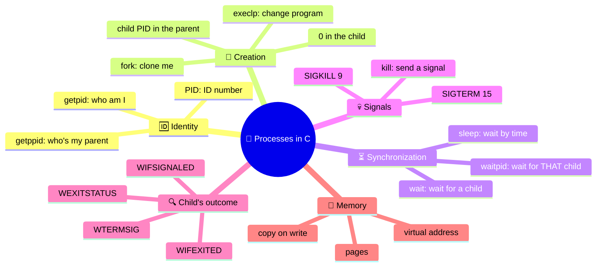
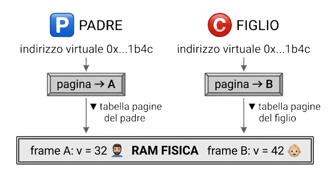
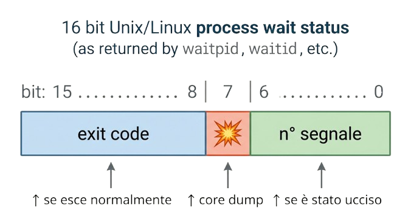
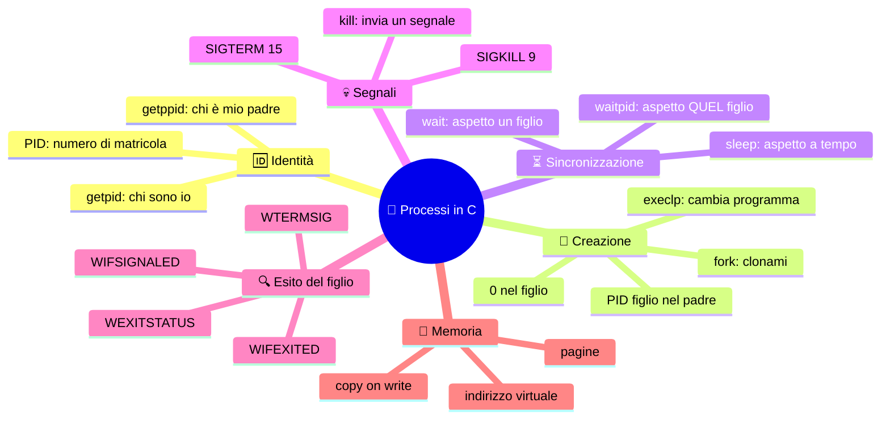

[](https://choosealicense.com/licenses/mit/)
[](https://opensource.org/licenses/)
[](http://www.gnu.org/licenses/agpl-3.0)

<a name="TOP"></a>

<a href="#IT"></a>
🤍
<a href="#EN"></a>

---

 <a name="EN"></A>

<!-- English -->

# 🧬 Processes in C on Linux: from a variable to `fork()` 🚀

> 🎬 *"Hey guys, welcome! Today we're finding out how a program can **clone itself**, **make people wait for it**, and, if needed, **get itself killed**."* 😈
> 🎓 A guide for high school students, but with the rigor of someone who actually uses processes. 🛠️

| 🧭 Info | 📌 Details |
|---:|---|
| 🐧 System | GNU/Linux and Unix-like (macOS, BSD...) |
| 🔧 Compiler | `gcc` |
| 📂 Folder | This `README.md` goes **next to the `.c` files** 📎 |
| 📈 Difficulty | Goes up level after level 🪜 |

---

## 📑 Contents

0. [🗺️ The mind map](#-the-mind-map)
1. [🟢 Level 0: What is a process? And the address of a variable](#-level-0-what-is-a-process-and-the-address-of-a-variable) → [`es0-varAddress.c`](./es0-varAddress.c)
2. [🟡 Level 1: `fork()`, PID and virtual memory](#-level-1-fork-pid-and-virtual-memory) → [`es1-memoryPage.c`](./es1-memoryPage.c)
3. [🟠 Level 2: `wait()`, the parent that waits](#-level-2-wait-the-parent-that-waits) → [`es2-wait.c`](./es2-wait.c)
4. [🔴 Level 3: the final boss](#-level-3-the-final-boss) → [`es3-ultimate.c`](./es3-ultimate.c)
5. [📚 Table of functions](#-table-of-functions)
6. [📡 Table of signals](#-table-of-signals)
7. [⚠️ Classic traps](#️-classic-traps)
8. [🧾 Final cheat sheet](#-final-cheat-sheet)

## 🗺️ The mind map

Before we dive in, here's the **big picture**. 🦅 Come back to it whenever you feel lost. 🧭



🖼️ Text/Schematic version:

🧬 Processes in C
| Description | Command list |
|---|---|
| 🆔 Identity | `getpid()` · `getppid()` |
| 🍴 Creation | `fork()` · `execlp()` |
| ⏳ Waiting | `sleep()` · `wait()` · `waitpid()` |
| 💀 Signals | `kill()` · `SIGKILL` · `SIGTERM` |
| 🔍 Child's outcome | `WIFEXITED` · `WEXITSTATUS` · `WIFSIGNALED` · `WTERMSIG` |
| 🧠 Memory | virtual addresses · pages · copy-on-write |

## 🟢 Level 0: What is a process? And the address of a variable

### 🧩 Program vs process

| 📦 Program | 🏃 Process |
|---|---|
| A **still** file sitting on the disk (e.g. `a.out`) 💾 | The program **running** in RAM ⚡ |
| There's only one of it | There can be **many** of them from the same program 👯 |
| It's the **recipe** 📖 | It's the **dish being cooked** 🍝 |

Every process has:

- 🆔 a **PID** (*Process IDentifier*): its ID number, unique as long as the process is alive;
- 👨‍👦 a **PPID** (*Parent PID*): the PID of the process that created it;
- 🧠 its **own memory space**, private and isolated from the others;
- 📋 a **state** (running, waiting, zombie... more on that later 🧟).

🔎 Curious? Open a terminal and try `ps` or `ps -ef`: you'll see all the processes with their PID and PPID. 👀

### 💻 Example 0: where does a variable live?

📎 File: [`es0-varAddress.c`](./es0-varAddress.c)

### 🔬 Line by line

| 🧾 Code | 🗣️ What it means |
|---|---|
| `int a = 10;` | I reserve some memory for an integer 📦 and put 10 in it |
| `&a` | The **"address of"** operator 📍: not the value, but **where** the variable lives |
| `a` | The **value** inside (10) 🔢 |
| `%d` | Placeholder for an integer in base 10 |
| `%x` | Placeholder for an integer in **hexadecimal** 🔡 |

🏠 **Analogy**: the variable is a *tenant*, the address is the *house number*. `a` tells you who's inside, `&a` tells you which street they live on. 📮

### 💡 A detail that makes you look like a pro

Here the address is printed with `%x`, which is made for **integers**. 🔢 On a 64-bit system an address is longer than an integer, so `%x` only shows the **lower part**. ✂️ To print a pointer the right way, it's better to use `%p` (with a cast to `void*`):

```c
printf("[%p] a = %d\n", (void*)&a, a);
```

| 🔡 Format | 📤 Output example | 🎯 When |
|---:|:---|---|
| `%x` | `[5a3c1b4c] a = 10` | Fine for understanding the idea, but it can cut the address short ✂️ |
| `%p` | `[0x7ffd5a3c1b4c] a = 10` | A format **made for pointers** ✅ |

### 🧪 Experiment

Compile and run it **a few times**:

```bash
gcc es0-varAddress.c -o es0
./es0
./es0
```

🎭 The address changes every time you run it! On modern distros the system uses **ASLR** (*Address Space Layout Randomization*) 🎲, a protection that moves the process's memory around randomly to make life harder for attackers. 🕵️

> 🧠 **Take-home message**: the address you see is **not** a real spot in RAM. It's a **virtual** address. Why does it matter? You'll find out in the next level. 👇

## 🟡 Level 1: `fork()`, PID and virtual memory

📎 File: [`es1-memoryPage.c`](./es1-memoryPage.c)

### 🍴 `fork()`: cloning

`fork()` **duplicates the process that calls it**. 🧬 After the call there are **two almost identical processes** that both restart **from the same line**. 😳

The magic is in the return value:

| 👤 Who gets it | 🔢 Value of `fork()` | 💬 Meaning |
|---|---|---|
| **Parent** 👨 | Child's PID (> 0) | "Here's your kid's ID number" 🍼 |
| **Child** 👶 | `0` | "You're the clone, you don't have a kid to look up" 🧬 |
| Nobody (error) ❌ | `-1` | The child couldn't be created (e.g. too many processes) 🚫 |

🤯 Got the trick? **One single line of code, two processes reading two different values**. That's how the code figures out *who's who*.

### 🆔 How to get the PIDs

| 🔧 Function | 📍 Returns |
|---|---|
| `getpid()` | The PID **of myself** 🙋 |
| `getppid()` | The PID **of my parent** 👨 |
| `fork()` (in the parent) | The PID **of my child** 👶 |

🔑 Golden rule: there is **no** "getchildpid" function. The parent knows the child's PID **only because it saves it** from the return value of `fork()`. 💾

### 💻 The code

📎 File: [`es1-memoryPage.c`](./es1-memoryPage.c)

### 🔬 What happens, step by step

1. 🍴 `fork()` clones the process. From here **two processes** run the line `int v = 37;`
2. 📦 **Each one** creates **its own** `v` and sets it to 37.
3. 👶 The child (`pid == 0`) does `v += 5` → **42** and prints **right away**.
4. 👨 The parent does `v -= 5` → **32**, then `sleep(3)` 😴 and prints **after 3 seconds**.

### 📺 Typical output

```text
[-] CHILD  [pid: 4521]  > fork() [pid: 0]    @ Parent [pid: 4520] > [5a3c1b4c] v = 42
[+] PARENT [pid: 4520]  > child [pid: 4521]  @ Parent [pid: 3987] > [5a3c1b4c] v = 32
```

### 🤔 The two weird things to notice

**1️⃣ In the parent's line, the "Parent [pid: 3987]" label doesn't mean the parent itself.** 🙃 `getppid()` called by the parent returns the PID of **its own** parent, which is the **shell** you launched the program from 🐚. The child, instead, sees the parent process (4520) as its PPID.

**2️⃣ The address of `v` is IDENTICAL in the two processes, but the values are different (42 vs 32)!** 🤯 How is that possible? Two variables in the same place holding different things?

### 🧠 Virtual memory and paging

The trick is that **the addresses you see are not physical addresses**. 🎭 Every process lives in its own **bubble**: it thinks it has all the memory to itself, with addresses starting from zero. 🫧 A component of the CPU, the **MMU** (*Memory Management Unit*), translates every virtual address into a physical one on the fly, using a **page table** 📒 for each process.



| 🧩 Concept | 🗣️ In plain words |
|---|---|
| **Virtual address** | The "house number" the program sees 🏷️ |
| **Physical address** | The **real** spot in RAM 📍 |
| **Page** | A block of memory of fixed size (usually **4 KiB**) 🧱 |
| **Frame** | The matching **physical** page in RAM 🖼️ |
| **MMU + page table** | The "translator" that connects the two worlds 🔄 |
| **Copy-on-write** 🐄 | After `fork()` parent and child **share** the pages. Only when one of them **writes**, the kernel makes a private copy ✂️ |

🏢 **Analogy**: two offices in two different buildings both have a "room 12". Same number (virtual address), different rooms (physical frames). 🚪

> 🧠 **Bottom line**: two processes can have the **same virtual address** and **different data**. That's why process memory is **isolated**: if the child goes crazy 🤪 it can't mess up the parent's data. 🛡️

### ⏱️ And what's `sleep(3)` for?

The parent sleeps for 3 seconds to **let the child talk first**. 😴➡️👶 It's synchronization "by eye", meaning **by time**:

- ✅ easy to write;
- ❌ **fragile**: if the child takes 4 seconds, the order falls apart. 💥

In the next level we'll see the right way to do it. 👇

## 🟠 Level 2: `wait()`, the parent that waits

### 💻 The code

📎 File: [`es2-wait.c`](./es2-wait.c)

### ✅ Scenario A: **with** `wait()` (the code as it is)

```text
PARENT (4520): looking for child (4521)...
CHILD (4521): I'm working...
	... 3 seconds of silence 😴 ...
CHILD (4521): I'm finish!
PARENT (4520): child (4521) finished!
$   ← 🐚 the prompt comes back ONLY now
```

`wait()` **blocks the parent** ✋ until a child finishes. Then it returns the PID of the child that finished. The print order is **guaranteed**. 🔒

(🔀 The first two lines can swap: parent and child start "together" and the scheduler decides who prints first. That's normal. 🎲)

### ❌ Scenario B: **without** `wait()` (comment out the three `wait` lines)

```text
PARENT (4520): looking for child (4521)...
$   ← 🐚 the prompt comes back RIGHT AWAY: the parent is already done!
CHILD (4521): I'm working...
CHILD (4521): I'm finish!   ← 👻 shows up later, "on top of" the prompt
```

What happened? The parent ended **without waiting**. The child became an **orphan process** 👶🪦: the kernel "adopts" it by handing it to `init`/`systemd` (PID 1, or another "subreaper"), and its `getppid()` changes. The child keeps working, but nobody is waiting for it anymore. 🙈

### 🧟 Bonus: the zombie

There's also the opposite case: the **child dies, but the parent is still alive and doesn't call `wait()`**. The child doesn't really disappear: it stays in the process table as a **zombie** 🧟, with state `Z`, because the kernel keeps its *exit code* around until the parent reads it.

🧪 **Experiment**: add `sleep(30);` in the parent **before** `wait()`, run it, and from another terminal type `ps -l`: you'll see the child with a `Z` and the label `<defunct>`. 💀

| 👶 Situation | 🏷️ Name | 😱 Consequence |
|---|---|---|
| Parent finishes **before** the child | **Orphan** | Adopted by PID 1 🏠 |
| Child finishes, parent **doesn't** call `wait()` | **Zombie** | Takes up an entry in the process table 🪦 |
| Child finishes, parent calls `wait()` | **Normal** | The kernel cleans everything up ✅ |

### 🔍 Something `es2` doesn't do yet

The child exits with `return 42;` but the parent **ignores** the value: `status` gets filled in and then never read! 🙊 In the final level we'll learn how to decode it. 👇

## 🔴 Level 3: the final boss

📎 File: [`es3-ultimate.c`](./es3-ultimate.c)

This example is a **little gym** for practice: it has live code and **commented-out** code 💤 that you can turn back on to explore different scenarios. Let's break it down. 🎁

### 🧱 Program structure

```text
main
├── fork()
│	├── pid < 0  → ❌ perror + return -1
│	├── pid == 0 → 👶 CHILD: print, count_down(5), [execlp?], return 53
│	└── pid > 0  → 👨 PARENT: print, [kill?], wait(), [macros?]
└── return 0
```

### ⏲️ `count_down()`: the countdown

```c
void count_down(const int seconds) {
	for(int i = 0; i < seconds; i++) {
		printf(" >");
		fflush(stdout);
		sleep(1);
	}
	printf(" wake up before %d seconds!\n", seconds);
}
```

🎬 It prints one `>` per second. Why do we need `fflush(stdout)`?
Because `printf` **doesn't write to the screen right away**: it collects the text in a **buffer** 🗃️ and only empties it when it finds a `\n` (new line) or when it's full.
Without `fflush`, all the `>` would show up **together at the end**.
💥 `fflush` forces it to empty the buffer immediately. 🚽

### 🎭 Scenario 1: smooth sailing (live code)

```text
[PARENT (PID 4520, child: 4521, PPID: 3987)]: waiting for the child...
[ CHILD (PID: 4521, PPID: 4520)]: I'm working...
 > > > > > wake up before 5 seconds!
[ CHILD (PID: 4521, PPID: 4520)]: finished!
[PARENT (PID 4520, child: 4521, PPID: 3987)]: child 4521 finished!
```

Here we use `wait(NULL)`: I wait, but I **don't care how the child ended**. 🤷

### 🎯 Scenario 2: reading the child's return value

The child does `return 53;`. We want the parent to find out. Two changes are needed:

1. 🔧 Pass `&status` to `wait` (instead of `NULL`);
2. 🔓 Uncomment the block with the **macros**.

```c
int status;
int child = wait(&status);
// ...
if (WIFEXITED(status))
	printf("child's (%d) return value = %d\n", child, WEXITSTATUS(status));
else if (WIFSIGNALED(status))
	printf("child (%d) killed by signal %d\n", child, WTERMSIG(status));
```

🧠 **Careful**: `status` is **not** the return value! It's a **packed** integer where the kernel stuffs several pieces of information together. 📦 Here's the structure (simplified, Linux):



To **avoid** doing bit-shifting by hand, there are the **macros** 🛠️ from `<sys/wait.h>`:

| 🛠️ Macro | ❓ Question it answers | 🔢 Result |
|---|---|---|
| `WIFEXITED(status)` | Did the child end **normally** (`return` or `exit`)? | True (≠ 0) / False (0) |
| `WEXITSTATUS(status)` | What's its **exit code**? | A number from **0 to 255** 🎚️ (**only valid if** `WIFEXITED` is true) |
| `WIFSIGNALED(status)` | Was it **killed by a signal**? | True / False |
| `WTERMSIG(status)` | **Which** signal killed it? | The signal number (e.g. 9) (**only valid if** `WIFSIGNALED` is true) |

⚠️ **Why only 0-255?** The exit code takes up 8 bits. 🧮 If the child did `return 300;` the parent would read `300 & 255 = 44`. By convention: **0 = success ✅**, **anything other than 0 = error ❌**.

📺 Output of this scenario:

```text
[PARENT ...]: child 4521 finished!
[PARENT ...]: child's (4521) return value = 53
```

### 💀 Scenario 3: the child gets **killed**

Uncomment the `kill` block in the parent:

```c
sleep(2);
printf("\n[PARENT (PID %d)]: Sending SIGKILL to child %d...\n", getpid(), pid);
if(kill(pid, 9) < 0) {
	perror("kill() failed!");
	return -1;
}
```

🎞️ **The timeline:**

```text
 t=0s  👨 parent: "waiting for the child..."     👶 child: "I'm working..."  >
 t=1s                                           👶  >
 t=2s  👨 wakes up → kill(pid, 9) 🔪             👶 💀 DIES (never finishes the countdown)
		👨 wait() returns right away
```

🔎 What we see:

- 👶 The child **never prints** "finished!" and **never reaches** `return 53`. SIGKILL can't be caught or ignored. 🚫🛡️
- 👨 `wait()` still returns with the child's PID. 🔓
- 📦 With `&status`, now **`WIFEXITED(status)` is false** ❌ and **`WIFSIGNALED(status)` is true** ✅, with `WTERMSIG(status) == 9`.

```text
[PARENT ...]: child (4521) killed by signal 9
```

🧯 **Technical note**: to use `kill()` and names like `SIGKILL` you need `#include <signal.h>`. In the original file there's a `9` and the header isn't included (the block is commented out). If you turn it back on, add the include, otherwise the compiler complains about an undeclared function. ⚠️ Even better: write `SIGKILL` instead of `9`, so the code explains itself. 📖

🖐️ Want to kill from the terminal? Same thing: `kill -9 4521` or `kill -KILL 4521`. 🖥️

#### 🤔 Why do we "kill" a process?

| 🎯 Reason | 💬 Example |
|---|---|
| **Stuck** process 🧊 | A program stops responding |
| **Timeout** ⏰ | A child takes too long and the parent loses patience |
| **Cleanup** 🧹 | The parent is exiting and wants to shut down its children too |
| **Security** 🛡️ | A runaway process eating all the CPU |

🥇 **Best practice**: first **ask nicely** (`SIGTERM`, 15 📩, the process can clean up and exit with dignity), and only if it doesn't listen, **bring out the hammer** (`SIGKILL`, 9 🔨).

### 🔄 Scenario 4: `execlp()`, the child changes jobs

In the child there's this commented-out line:

```c
execlp("sh", "sh", "-c", "hostname -I | awk '{print $1}'", NULL);
```

🎭 `fork()` **creates** a process; `exec` **transforms** an existing one. The process **keeps the same PID**, but its code, data and stack get **replaced** by another program. 🦋 The old program **doesn't exist anymore**.

| 🧾 Parameter | 🗣️ Meaning |
|---:|---|
| `"sh"` (1st) | The **file** to run: it's looked up in the `PATH` folders (the **p** in `execlp`) 🔍 |
| `"sh"` (2nd) | `argv[0]`: the name the program "introduces itself" with 🏷️ |
| `"-c"` | Tells the shell: "run the **string** that follows" 📜 |
| `"hostname -I \| awk ..."` | The command: prints the machine's first IP address 🌐 |
| `NULL` | The **terminator** of the argument list ✋ (mandatory!) |

🔤 **Why the name `execlp`?** `exec` = execute · **l** = arguments passed as a **l**ist · **p** = searches the **P**ATH.

🤔 **Why go through `sh -c`?** Because the command contains a **pipe** `|`, and only a shell understands that. Running `hostname` directly wouldn't let you connect it to `awk`. 🔗

🚨 **Effects on the program:**

- If `execlp` **succeeds**, it **never returns** ✈️: the lines after it (`printf("... finished!")` and `return 53`) **don't get executed**. 🫥
- If it **fails**, it returns `-1` and the code keeps going (that's why after an `exec` it's a good idea to put `perror` and `_exit`). ❌
- 🔢 The exit code the parent sees will be the one of the **new program** (usually 0), **not 53**. 🎭

```text
[PARENT ...]: waiting for the child...
[ CHILD ...]: I'm working...
 > > > > > wake up before 5 seconds!
192.168.1.25      ← 🌐 output of hostname | awk, written by the "new" child
[PARENT ...]: child 4521 finished!
```

### ⏳ `waitpid()`: precision waiting

Inside `es3` there's a hint: `// waitpid(-1, &status, 0);`. 🕵️ It means that **`wait(&status)` is a special case of `waitpid`**:

```c
wait(&status)   ≡   waitpid(-1, &status, 0)
```

```c
pid_t waitpid(pid_t pid, int *wstatus, int options);
```

#### 🎯 The first parameter: **who** I wait for

| 🔢 `pid` | 🗣️ I wait for... |
|---|---|
| `> 0` | exactly **that** child 🎯 |
| `-1` | **any one** of my children 🎲 (like `wait`) |
| `0` | a child in my **same process group** 👥 |
| `< -1` | a child in the group `\|pid\|` 👪 |

#### 🎚️ The third parameter: **how** I wait

| 🚩 `options` | 🗣️ Effect |
|---:|---|
| `0` | **Blocking**: I stop until the child finishes ✋ |
| `WNOHANG` | **Non-blocking**: if it hasn't finished yet I come back **right away** with `0` 🏃 |
| `WUNTRACED` | I wake up also if the child gets **stopped** (e.g. `SIGSTOP`) ⏸️ |
| `WCONTINUED` | I wake up also if a stopped child **starts again** ▶️ |

#### 🔁 What it returns

| 🔢 Value | 💬 Meaning |
|---|---|
| `> 0` | PID of the child whose state changed ✅ |
| `0` | Only with `WNOHANG`: no child has finished yet ⏳ |
| `-1` | Error ❌ (`errno`: `ECHILD` no child to wait for, `EINTR` interrupted by a signal) |

### 🆚 The difference between `pid` and `child` in the code

```c
int pid	  = fork();			// ← "pid":		who fork created (the child, seen from the parent)
int child = wait(NULL);		// ← "child":	who wait returned (the child that finished)
```

| 🏷️ Variable | 🧾 Where it comes from | 💬 Meaning |
|---:|---|---|
| `pid` | Return value of `fork()` | The child I **created** 🍼 |
| `child` | Return value of `wait()` | The child that **just finished** 🏁 |

With **just one child** they're the same. 👯 With **more children** they're **not**: `wait()` returns the **first one that finishes**, whichever it is. If you want to wait for a specific one, use `waitpid(pid, ...)`. 🎯

🛡️ **And that's why `child < 0` must be checked**: if you have no children (or something goes wrong) `wait` returns `-1` and `perror("wait() failed!")` tells you why. 🔍

## 📚 Table of functions

> ℹ️ **Who runs it?** tells you who can/must call the function and who feels its effect. 🙋

| 🔧 Function | 📦 Library | ✍️ Signature | 🔁 Returns | 🙋 Who runs it |
|---|---|---|---|---|
| 🖨️ `printf` | `<stdio.h>` | `int printf(const char *format, ...)` | Number of characters printed; **negative** on error ❌ | Any process |
| 🧯 `perror` | `<stdio.h>` | `void perror(const char *s)` | Nothing (`void`). Prints `s` + a description of `errno` 📝 | Any process, after a failed call |
| 🚽 `fflush` | `<stdio.h>` | `int fflush(FILE *stream)` | `0` ok · `EOF` error | Any process |
| 🙋 `getpid` | `<unistd.h>` | `pid_t getpid(void)` | **PID of the calling process**. Never fails ✅ | Any process (parent or child) |
| 👨 `getppid` | `<unistd.h>` | `pid_t getppid(void)` | **PID of the parent**. Never fails ✅ | Any process |
| 🍴 `fork` | `<unistd.h>` | `pid_t fork(void)` | **Parent**: child's PID (>0) · **Child**: `0` · **Error**: `-1` ❌ | Any process: after the call **two of them run it** |
| 😴 `sleep` | `<unistd.h>` | `unsigned int sleep(unsigned int seconds)` | `0` if it slept the whole time · otherwise the **seconds left** (interrupted by a signal) ⏰ | Any process (**it only suspends itself**) |
| ⏳ `wait` | `<sys/wait.h>` | `pid_t wait(int *wstatus)` | PID of the child that finished · `-1` error (e.g. **no children**, `ECHILD`) | **Only a parent**, for its **own** children 🍼 |
| 🎯 `waitpid` | `<sys/wait.h>` | `pid_t waitpid(pid_t pid, int *wstatus, int options)` | PID of the child · `0` (with `WNOHANG`, none ready) · `-1` error | **Only a parent**, for its **own** children 🍼 |
| 💀 `kill` | `<signal.h>` | `int kill(pid_t pid, int sig)` | `0` signal sent ✅ · `-1` error ❌ | Any process **with permission** (same user, or `root`) 🔑 |
| 🔄 `execlp` | `<unistd.h>` | `int execlp(const char *file, const char *arg, ... /*, NULL */)` | **Never** if it succeeds ✈️ · `-1` if it fails | Any process (**it replaces itself**) |

### 🔍 `kill()`: the details that matter

Despite its name, `kill` **doesn't necessarily kill**: it **sends a signal**. 📨 What happens depends on the signal and on `pid`:

| 🔢 `pid` | 🎯 Target |
|:---:|---|
| `> 0` | The process with that PID |
| `0` | All the processes in the caller's **group** 👥 |
| `-1` | **All** the processes you have permission for (⚠️ dangerous!) 💣 |
| `< -1` | The group `\|pid\|` |
| `sig = 0` | **No signal**: it's only used to **test** whether the process exists and whether you have permission 🧪 |

| ❌ Error (`errno`) | 💬 Meaning |
|---:|---|
| `EPERM` | You don't have **permission** to signal that process 🚫 |
| `ESRCH` | That process (or group) **doesn't exist** 👻 |
| `EINVAL` | The **signal** isn't valid 🤷 |

### 🧰 The macros of `<sys/wait.h>`

| 🛠️ Macro | 🔁 Returns | 🔓 Use it when |
|:---:|---|---|
| `WIFEXITED(status)` | `≠ 0` if normal exit | Always, **first** 🥇 |
| `WEXITSTATUS(status)` | Exit code (0-255) | Only if `WIFEXITED` is true ✅ |
| `WIFSIGNALED(status)` | `≠ 0` if killed by a signal | If `WIFEXITED` is false |
| `WTERMSIG(status)` | Signal number | Only if `WIFSIGNALED` is true ✅ |

## 📡 Table of signals

Signals are declared in **`<signal.h>`** 📂. 📨 They're "messages" that the kernel or other processes send to a process. The numbers below are the ones for **Linux on x86/ARM** (on other Unix systems they can be different, which is why it's better to use the **names**). 📖

| 📛 Name | 🔢 No. | 📝 Meaning | 🧱 Can it be caught/ignored? | 💡 Typical use |
|:---:|:---|---|---|---|
| `SIGHUP` | 1 | Terminal closed / reload configuration 📞 | ✅ Yes | Closing a session |
| `SIGINT` | 2 | Keyboard interrupt ⌨️ | ✅ Yes | **Ctrl+C** |
| `SIGQUIT` | 3 | Quit with core dump 💥 | ✅ Yes | **Ctrl+\\** |
| `SIGKILL` | **9** | **Immediate kill** 🔪 | ❌ **No** | `kill -9` |
| `SIGUSR1` | 10 | **User-defined** signal 🧩 | ✅ Yes | Communication between processes |
| `SIGSEGV` | 11 | **Illegal memory access** 🧨 | ✅ Yes (not recommended) | The infamous *segmentation fault* |
| `SIGPIPE` | 13 | Writing to a pipe with no reader 🚰 | ✅ Yes | Closed pipe |
| `SIGALRM` | 14 | A timer runs out ⏰ | ✅ Yes | `alarm()` |
| `SIGTERM` | **15** | **Polite request** to terminate 🤝 | ✅ Yes | **Default of `kill`** |
| `SIGCHLD` | 17 | **A child terminated/stopped** 👶 | ✅ Yes (ignored by default) | Notification to the parent |
| `SIGCONT` | 18 | Resume a stopped process ▶️ | ✅ Yes | `fg`, `bg` |
| `SIGSTOP` | 19 | **Stop** the process ⏸️ | ❌ **No** | Forced suspension |
| `SIGTSTP` | 20 | Keyboard stop 🛑 | ✅ Yes | **Ctrl+Z** |

🧠 **Remember**: only **`SIGKILL`** and **`SIGSTOP`** can't be caught or ignored. 🔒 That's why `kill -9` is the "finishing blow"… and that's why you use it **last**: the process has no chance to save its data or close its files. 📂💥

## ⚠️ Classic traps

| 🪤 Trap | 😱 What happens | 🛟 Fix |
|---|---|---|
| Forgetting to check `fork() < 0` | The code thinks it's in the child/parent but it isn't | Always handle the **three cases** (`<0`, `==0`, `>0`) 🔱 |
| Using `sleep` to synchronize | Works "sometimes" 🎲 | Use `wait`/`waitpid` ✅ |
| Reading `status` directly | Unreadable numbers (e.g. 13568 instead of 53) 🤯 | Use **the macros** 🛠️ |
| `WEXITSTATUS` without `WIFEXITED` | **Meaningless** value 🎭 | Check `WIFEXITED` **first** |
| Forgetting `NULL` in `execlp` | **Undefined** behavior 💣 | Always end the list with `NULL` |
| Code after `execlp` | Never runs (if it works) 🫥 | Put only error handling there |
| `printf` without `\n` or `fflush` | Output shows up late ⏳ | `fflush(stdout)` 🚽 |
| Not calling `wait` on children | **Zombies** 🧟 | One `wait` for every `fork` |
| Using `kill(-1, ...)` | You can hit **all** your processes 💣 | Always give a specific PID 🎯 |

## 🧾 Final cheat sheet

### 🎓 The Story in 8 Lines

1. 🏃 A PROCESS is a running program, with a PID and a memory all its own.
2. 📍 The addresses you print (`&a`) are VIRTUAL: same address ≠ same RAM.
3. 🍴 `fork()` clones the process: it returns 0 to the child and the child's PID to the parent.
4. 🆔 `getpid()` = me · `getppid()` = my parent · you save the child's PID from `fork()`.
5. 😴 `sleep()` synchronizes "by time" (fragile) · ⏳ `wait()` synchronizes "by event" (solid).
6. 🔍 The child's return value is read with status + macros (`WIFEXITED/WEXITSTATUS`).
7. 💀 `kill(pid, SIGKILL)` kills · `WIFSIGNALED/WTERMSIG` tell you who and how.
8. 🔄 `execlp()` turns the process into another program: if it works, there's no coming back.

| 🪜 Level | 📎 File | 🧠 Key concept | 🔧 New functions |
|---|---|---|---|
| 🟢 0 | [`es0-varAddress.c`](./es0-varAddress.c) | Address of a variable | `printf`, `&` |
| 🟡 1 | [`es1-memoryPage.c`](./es1-memoryPage.c) | Cloning and virtual memory | `fork`, `getpid`, `getppid`, `sleep`, `perror` |
| 🟠 2 | [`es2-wait.c`](./es2-wait.c) | Synchronization, orphans, zombies | `wait` |
| 🔴 3 | [`es3-ultimate.c`](./es3-ultimate.c) | Outcome, signals, exec | `waitpid`, `kill`, `execlp`, `fflush`, `W*` macros |

### ▶️ How to compile and run

```bash
gcc es0-varAddress.c -o es0 && ./es0
gcc es1-memoryPage.c   -o es1 && ./es1
gcc es2-wait.c         -o es2 && ./es2
gcc es3-ultimate.c     -o es3 && ./es3
```

### 🏋️ Challenges for the brave

1. 🔡 Change `es0` to print the address with `%p` and compare it with `%x`.
2. 🍴 In `es1`, what happens if you move `int v = 37;` **before** `fork()`? And if you remove `sleep(3)`?
3. 🧟 In `es2`, create a zombie and look at it with `ps`.
4. 💀 In `es3`, write a program where the parent kills the child with `SIGKILL` **only if** it doesn't finish within 3 seconds (hint: `waitpid` with `WNOHANG` in a loop).
5. 👨‍👧‍👦 Create **three children** with a loop and use `waitpid(-1, ...)` to see the order they finish in.

🎉 **The end!** If you made it this far, you now know what's going on behind the scenes every time you open a program. 🧬 See you next time: *pipes, signals with `signal()` and threads!* 🔥


---

<a href="#IT"></a>
🤍
<a href="#EN"></a>

---

 <a name="IT"></A>

<!-- Italiano -->

# 🧬 Processi in C su Linux: dalla variabile al `fork()` 🚀

> 🎬 *"Ehi ragazzi, benvenuti! Oggi scopriamo come un programma riesce a **clonarsi**, a **farsi aspettare** e, se serve, a **farsi uccidere**."* 😈
> 🎓 Guida per studenti delle superiori, ma con il rigore di chi i processi li usa davvero. 🛠️

| 🧭 Info | 📌 Dettaglio |
|---:|---|
| 🐧 Sistema | GNU/Linux e Unix-like (macOS, BSD...) |
| 🔧 Compilatore | `gcc` |
| 📂 Cartella | Questo `README.md` va messo **accanto ai file `.c`** 📎 |
| 📈 Difficoltà | Cresce livello dopo livello 🪜 |

---

## 📑 Indice

0. [🗺️ La mappa mentale](#-la-mappa-mentale)
1. [🟢 Livello 0: Cos'è un processo? E l'indirizzo di una variabile](#-livello-0-cosè-un-processo-e-lindirizzo-di-una-variabile) → [`es0-varAddress.c`](./es0-varAddress.c)
2. [🟡 Livello 1: `fork()`, PID e memoria virtuale](#-livello-1-fork-pid-e-memoria-virtuale) → [`es1-memoryPage.c`](./es1-memoryPage.c)
3. [🟠 Livello 2: `wait()`, il padre che aspetta](#-livello-2-wait-il-padre-che-aspetta) → [`es2-wait.c`](./es2-wait.c)
4. [🔴 Livello 3: il boss finale](#-livello-3-il-boss-finale) → [`es3-ultimate.c`](./es3-ultimate.c)
5. [📚 Tabella delle funzioni](#-tabella-delle-funzioni)
6. [📡 Tabella dei segnali](#-tabella-dei-segnali)
7. [⚠️ Trappole classiche](#️-trappole-classiche)
8. [🧾 Cheat sheet finale](#-cheat-sheet-finale)

## 🗺️ La mappa mentale

Prima di tuffarci, ecco la **vista dall'alto**. 🦅 Tornaci ogni volta che ti senti perso. 🧭



🖼️ Versione Testuale/Schematica:

🧬 Processi in C
| Descrizione | Lista comandi |
|---|---|
| 🆔 Identità | `getpid()` · `getppid()` |
| 🍴 Creazione | `fork()` · `execlp()` |
| ⏳ Attesa | `sleep()` · `wait()` · `waitpid()` |
| 💀 Segnali | `kill()` · `SIGKILL` · `SIGTERM` |
| 🔍 Esito figlio | `WIFEXITED` · `WEXITSTATUS` · `WIFSIGNALED` · `WTERMSIG` |
| 🧠 Memoria | indirizzi virtuali · pagine · copy-on-write |

## 🟢 Livello 0: Cos'è un processo? E l'indirizzo di una variabile

### 🧩 Programma vs processo

| 📦 Programma | 🏃 Processo |
|---|---|
| Un file **fermo** sul disco (es. `a.out`) 💾 | Il programma **in esecuzione** nella RAM ⚡ |
| Ne esiste uno solo | Ne possono esistere **tanti** dallo stesso programma 👯 |
| È la **ricetta** 📖 | È il **piatto che si sta cucinando** 🍝 |

Ogni processo ha:

- 🆔 un **PID** (*Process IDentifier*): il numero di matricola, unico finché il processo vive;
- 👨‍👦 un **PPID** (*Parent PID*): il PID del processo che l'ha creato;
- 🧠 il **proprio spazio di memoria**, privato e isolato dagli altri;
- 📋 uno **stato** (in esecuzione, in attesa, zombie... ne parliamo dopo 🧟).

🔎 Curiosone? Apri un terminale e prova `ps` oppure `ps -ef`: vedi tutti i processi con PID e PPID. 👀

### 💻 L'esempio 0: dove vive una variabile?

📎 File: [`es0-varAddress.c`](./es0-varAddress.c)

### 🔬 Lettura riga per riga

| 🧾 Codice | 🗣️ Cosa significa |
|---|---|
| `int a = 10;` | Riservo in memoria uno spazio per un intero 📦 e ci scrivo 10 |
| `&a` | Operatore **"indirizzo di"** 📍: non il valore, ma **dove** abita la variabile |
| `a` | Il **valore** contenuto (10) 🔢 |
| `%d` | Segnaposto per un intero in base 10 |
| `%x` | Segnaposto per un intero in **esadecimale** 🔡 |

🏠 **Metafora**: la variabile è un *inquilino*, l'indirizzo è il *numero civico*. `a` ti dice chi c'è dentro, `&a` ti dice in che via abita. 📮

### 💡 Un dettaglio che fa il pro

Qui l'indirizzo viene stampato con `%x`, che è pensato per **numeri interi**. 🔢 Su un sistema a 64 bit un indirizzo è più lungo di un intero, quindi `%x` ne mostra solo la **parte bassa**. ✂️ Per stampare un puntatore per bene è più opportuno usare `%p` (con il cast a `void*`):

```c
printf("[%p] a = %d\n", (void*)&a, a);
```

| 🔡 Formato | 📤 Esempio di output | 🎯 Quando |
|---:|:---|---|
| `%x` | `[5a3c1b4c] a = 10` | Va bene per capire il concetto, ma può troncare ✂️ |
| `%p` | `[0x7ffd5a3c1b4c] a = 10` | Formato **pensato per i puntatori** ✅ |

### 🧪 Esperimento

Compila ed esegui **più volte**:

```bash
gcc es0-varAddress.c -o es0
./es0
./es0
```

🎭 L'indirizzo cambia a ogni esecuzione! Sulle distribuzioni attuali il sistema applica l'**ASLR** (*Address Space Layout Randomization*) 🎲, una protezione che sposta a caso la memoria del processo per rendere la vita difficile agli attaccanti. 🕵️

> 🧠 **Da portarsi a casa**: l'indirizzo che vedi **non è** un posto fisico della RAM. È un indirizzo **virtuale**. Perché conta? Lo scopri nel prossimo livello. 👇

## 🟡 Livello 1: `fork()`, PID e memoria virtuale

📎 File: [`es1-memoryPage.c`](./es1-memoryPage.c)

### 🍴 `fork()`: la clonazione

`fork()` **duplica il processo che la chiama**. 🧬 Dopo la chiamata ci sono **due processi** quasi identici che ripartono **dalla stessa riga**. 😳

La magia sta nel valore di ritorno:

| 👤 Chi lo riceve | 🔢 Valore di `fork()` | 💬 Significato |
|---|---|---|
| **Padre** 👨 | PID del figlio (> 0) | "Ecco il numero di matricola di tuo figlio" 🍼 |
| **Figlio** 👶 | `0` | "Sei il clone, non hai un figlio da conoscere" 🧬 |
| Nessuno (errore) ❌ | `-1` | Non si è potuto creare il figlio (es. troppi processi) 🚫 |

🤯 Capito il trucco? **Una sola riga di codice, due processi che leggono due valori diversi**. È così che il codice capisce *chi è chi*.

### 🆔 Come ottenere i PID

| 🔧 Funzione | 📍 Restituisce |
|---|---|
| `getpid()` | Il PID **di me stesso** 🙋 |
| `getppid()` | Il PID **di mio padre** 👨 |
| `fork()` (nel padre) | Il PID **di mio figlio** 👶 |

🔑 Regola d'oro: **non esiste** una funzione "getchildpid". Il padre conosce il PID del figlio **solo perché lo salva** dal ritorno di `fork()`. 💾

### 💻 Il codice

📎 File: [`es1-memoryPage.c`](./es1-memoryPage.c)

### 🔬 Cosa succede, passo passo

1. 🍴 `fork()` clona il processo. Da qui **due processi** eseguono la riga `int v = 37;`
2. 📦 **Ciascuno** crea la **propria** `v` e la mette a 37.
3. 👶 Il figlio (`pid == 0`) fa `v += 5` → **42** e stampa **subito**.
4. 👨 Il padre fa `v -= 5` → **32**, poi `sleep(3)` 😴 e stampa **dopo 3 secondi**.

### 📺 Output tipico

```text
[-] CHILD  [pid: 4521]  > fork() [pid: 0]    @ Parent [pid: 4520] > [5a3c1b4c] v = 42
[+] PARENT [pid: 4520]  > child [pid: 4521]  @ Parent [pid: 3987] > [5a3c1b4c] v = 32
```

### 🤔 Le due cose strane da notare

**1️⃣ Nella riga del padre, l'etichetta "Parent [pid: 3987]" non è il padre di sé stesso.** 🙃 `getppid()` chiamato dal padre restituisce il PID **del suo** genitore, cioè la **shell** da cui hai lanciato il programma 🐚. Il figlio invece vede come PPID il processo padre (4520).

**2️⃣ L'indirizzo di `v` è IDENTICO nei due processi, ma i valori sono diversi (42 vs 32)!** 🤯 Come è possibile? Due variabili nello stesso posto che valgono cose diverse?

### 🧠 La memoria virtuale e la paginazione

Il trucco è che **gli indirizzi che vedi non sono indirizzi fisici**. 🎭 Ogni processo vive in una sua **bolla**: crede di avere tutta la memoria per sé, con indirizzi che partono da zero. 🫧 Un componente della CPU, la **MMU** (*Memory Management Unit*), traduce al volo ogni indirizzo virtuale in uno fisico, usando una **tabella delle pagine** 📒 per ciascun processo.


| 🧩 Concetto | 🗣️ In parole povere |
|---|---|
| **Indirizzo virtuale** | Il "numero civico" che vede il programma 🏷️ |
| **Indirizzo fisico** | Il posto **vero** nella RAM 📍 |
| **Pagina** | Un blocco di memoria di dimensione fissa (tipicamente **4 KiB**) 🧱 |
| **Frame** | La pagina **fisica** corrispondente in RAM 🖼️ |
| **MMU + tabella delle pagine** | Il "traduttore" che collega i due mondi 🔄 |
| **Copy-on-write** 🐄 | Dopo `fork()` padre e figlio **condividono** le pagine. Solo quando uno **scrive**, il kernel ne fa una copia privata ✂️ |

🏢 **Metafora**: due uffici in due palazzi diversi hanno entrambi la "stanza 12". Stesso numero (indirizzo virtuale), stanze diverse (frame fisici). 🚪

> 🧠 **Conclusione**: due processi possono avere lo **stesso indirizzo virtuale** e **dati diversi**. Ecco perché la memoria dei processi è **isolata**: se il figlio impazzisce 🤪 non rovina i dati del padre. 🛡️

### ⏱️ E il ruolo di `sleep(3)`?

Il padre dorme 3 secondi per **far parlare prima il figlio**. 😴➡️👶 È una sincronizzazione "a occhio", cioè **a tempo**:

- ✅ semplice da scrivere;
- ❌ **fragile**: se il figlio ci mette 4 secondi, l'ordine salta. 💥

Nel prossimo livello vediamo il metodo giusto. 👇

## 🟠 Livello 2: `wait()`, il padre che aspetta

### 💻 Il codice

📎 File: [`es2-wait.c`](./es2-wait.c)

### ✅ Scenario A: **con** `wait()` (il codice com'è)

```text
PARENT (4520): looking for child (4521)...
CHILD (4521): I'm working...
	... 3 secondi di silenzio 😴 ...
CHILD (4521): I'm finish!
PARENT (4520): child (4521) finished!
$   ← 🐚 il prompt torna SOLO ora
```

`wait()` **blocca il padre** ✋ finché un figlio non termina. Poi restituisce il PID del figlio terminato. L'ordine delle stampe è **garantito**. 🔒

(🔀 Le prime due righe possono invertirsi: padre e figlio partono "insieme" e lo scheduler decide chi stampa per primo. È normale. 🎲)

### ❌ Scenario B: **senza** `wait()` (commenta le tre righe di `wait`)

```text
PARENT (4520): looking for child (4521)...
$   ← 🐚 il prompt torna SUBITO: il padre è già finito!
CHILD (4521): I'm working...
CHILD (4521): I'm finish!   ← 👻 compare dopo, "sopra" il prompt
```

Cosa è successo? Il padre è terminato **senza aspettare**. Il figlio è diventato un **processo orfano** 👶🪦: il kernel lo "adotta" assegnandolo a `init`/`systemd` (PID 1, oppure un altro "subreaper"), e il suo `getppid()` cambia. Il lavoro del figlio continua, ma nessuno lo sta più aspettando. 🙈

### 🧟 Bonus: lo zombie

C'è anche il caso opposto: il **figlio muore, ma il padre è ancora vivo e non chiama `wait()`**. Il figlio non sparisce davvero: resta nella tabella dei processi come **zombie** 🧟, con stato `Z`, perché il kernel conserva il suo *codice d'uscita* nell'attesa che il padre lo legga.

🧪 **Esperimento**: aggiungi `sleep(30);` nel padre **prima** di `wait()`, lancialo e da un altro terminale digita `ps -l`: vedrai il figlio con `Z` e la scritta `<defunct>`. 💀

| 👶 Situazione | 🏷️ Nome | 😱 Conseguenza |
|---|---|---|
| Padre finisce **prima** del figlio | **Orfano** | Adottato da PID 1 🏠 |
| Figlio finisce, padre **non** fa `wait()` | **Zombie** | Occupa una voce nella tabella dei processi 🪦 |
| Figlio finisce, padre fa `wait()` | **Normale** | Il kernel libera tutto ✅ |

### 🔍 Una cosa che `es2` non fa ancora

Il figlio esce con `return 42;` ma il padre **ignora** il valore: `status` viene riempito e poi mai letto! 🙊 Nel livello finale impariamo a decodificarlo. 👇

## 🔴 Livello 3: il boss finale

📎 File: [`es3-ultimate.c`](./es3-ultimate.c)

Questo esempio è una **piccola palestra**: contiene codice attivo e codice **commentato** 💤 che puoi riattivare per esplorare scenari diversi. Spacchettiamolo. 🎁

### 🧱 Struttura del programma

```text
main
├── fork()
│	├── pid < 0  → ❌ perror + return -1
│	├── pid == 0 → 👶 FIGLIO: stampa, count_down(5), [execlp?], return 53
│	└── pid > 0  → 👨 PADRE: stampa, [kill?], wait(), [macro?]
└── return 0
```

### ⏲️ `count_down()`: il conto alla rovescia

```c
void count_down(const int seconds) {
	for(int i = 0; i < seconds; i++) {
		printf(" >");
		fflush(stdout);
		sleep(1);
	}
	printf(" wake up before %d seconds!\n", seconds);
}
```

🎬 Stampa un `>` al secondo. Perché serve `fflush(stdout)`?
Perché `printf` **non scrive subito** sullo schermo: accumula il testo in un **buffer** 🗃️ e lo svuota solo quando trova un `\n` (a capo) o quando è pieno.
Senza `fflush`, i `>` comparirebbero **tutti insieme alla fine**.
💥 `fflush` forza lo svuotamento immediato. 🚽

### 🎭 Scenario 1: tutto liscio (codice attivo)

```text
[PARENT (PID 4520, child: 4521, PPID: 3987)]: waiting for the child...
[ CHILD (PID: 4521, PPID: 4520)]: I'm working...
 > > > > > wake up before 5 seconds!
[ CHILD (PID: 4521, PPID: 4520)]: finished!
[PARENT (PID 4520, child: 4521, PPID: 3987)]: child 4521 finished!
```

Qui è usato `wait(NULL)`: aspetto, ma **non mi interessa come è finito** il figlio. 🤷

### 🎯 Scenario 2: leggere il valore di ritorno del figlio

Il figlio fa `return 53;`. Vogliamo che il padre lo scopra. Servono due modifiche:

1. 🔧 Passare `&status` a `wait` (al posto di `NULL`);
2. 🔓 Decommentare il blocco con le **macro**.

```c
int status;
int child = wait(&status);
// ...
if (WIFEXITED(status))
	printf("child's (%d) return value = %d\n", child, WEXITSTATUS(status));
else if (WIFSIGNALED(status))
	printf("child (%d) killed by signal %d\n", child, WTERMSIG(status));
```

🧠 **Attenzione**: `status` **non è** il valore di ritorno! È un intero **impacchettato** in cui il kernel infila più informazioni insieme. 📦 Ecco la struttura (semplificata, Linux):


Per **non** fare bit-shifting a mano, esistono le **macro** 🛠️ di `<sys/wait.h>`:

| 🛠️ Macro | ❓ Domanda a cui risponde | 🔢 Risultato |
|---|---|---|
| `WIFEXITED(status)` | Il figlio è terminato **normalmente** (`return` o `exit`)? | Vero (≠ 0) / Falso (0) |
| `WEXITSTATUS(status)` | Qual è il suo **codice d'uscita**? | Un numero **0-255** 🎚️ (**valido solo se** `WIFEXITED` è vera) |
| `WIFSIGNALED(status)` | È stato **ucciso da un segnale**? | Vero / Falso |
| `WTERMSIG(status)` | **Quale** segnale l'ha ucciso? | Il numero del segnale (es. 9) (**valido solo se** `WIFSIGNALED` è vera) |

⚠️ **Perché solo 0-255?** Il codice d'uscita occupa 8 bit. 🧮 Se il figlio facesse `return 300;` il padre leggerebbe `300 & 255 = 44`. Per convenzione: **0 = successo ✅**, **diverso da 0 = errore ❌**.

📺 Output di questo scenario:

```text
[PARENT ...]: child 4521 finished!
[PARENT ...]: child's (4521) return value = 53
```

### 💀 Scenario 3: il figlio viene **ammazzato**

Decommenta il blocco `kill` nel padre:

```c
sleep(2);
printf("\n[PARENT (PID %d)]: Sending SIGKILL to child %d...\n", getpid(), pid);
if(kill(pid, 9) < 0) {
	perror("kill() failed!");
	return -1;
}
```

🎞️ **La timeline:**

```text
 t=0s  👨 padre: "waiting for the child..."     👶 figlio: "I'm working..."  >
 t=1s                                           👶  >
 t=2s  👨 si sveglia → kill(pid, 9) 🔪           👶 💀 MUORE (non finisce il conto)
		👨 wait() ritorna subito
```

🔎 Cosa osserviamo:

- 👶 Il figlio **non stampa mai** "finished!" e **non arriva mai** a `return 53`. SIGKILL non può essere intercettato né ignorato. 🚫🛡️
- 👨 `wait()` ritorna comunque con il PID del figlio. 🔓
- 📦 Con `&status`, ora **`WIFEXITED(status)` è falso** ❌ e **`WIFSIGNALED(status)` è vero** ✅, con `WTERMSIG(status) == 9`.

```text
[PARENT ...]: child (4521) killed by signal 9
```

🧯 **Nota tecnica**: per usare `kill()` e i nomi come `SIGKILL` serve `#include <signal.h>`. Nel file originale compare `9` e l'header non è incluso (il blocco è commentato). Se lo riattivi, aggiungi l'include, altrimenti il compilatore si lamenta della funzione non dichiarata. ⚠️ E meglio ancora: scrivi `SIGKILL` invece di `9`, il codice si legge da solo. 📖

🖐️ Ammazzare dal terminale? Stessa cosa: `kill -9 4521` oppure `kill -KILL 4521`. 🖥️

#### 🤔 Perché si "ammazza" un processo?

| 🎯 Motivo | 💬 Esempio |
|---|---|
| Processo **bloccato** 🧊 | Un programma non risponde più |
| **Timeout** ⏰ | Un figlio impiega troppo e il padre perde la pazienza |
| **Pulizia** 🧹 | Il padre termina e vuole chiudere anche i figli |
| **Sicurezza** 🛡️ | Processo impazzito che consuma tutta la CPU |

🥇 **Buona pratica**: prima **chiedi con gentilezza** (`SIGTERM`, 15 📩, il processo può ripulire e uscire con dignità), e solo se non obbedisce **usa il martello** (`SIGKILL`, 9 🔨).

### 🔄 Scenario 4: `execlp()`, il figlio cambia mestiere

Nel figlio c'è questa riga commentata:

```c
execlp("sh", "sh", "-c", "hostname -I | awk '{print $1}'", NULL);
```

🎭 `fork()` **crea** un processo; `exec` **trasforma** quello esistente. Il processo **mantiene lo stesso PID**, ma il suo codice, i dati e lo stack vengono **sostituiti** da un altro programma. 🦋 Il vecchio programma **non esiste più**.

| 🧾 Parametro | 🗣️ Significato |
|---:|---|
| `"sh"` (1°) | **File** da eseguire: cercato nelle cartelle del `PATH` (la **p** di `execlp`) 🔍 |
| `"sh"` (2°) | `argv[0]`: il nome con cui il programma "si presenta" 🏷️ |
| `"-c"` | Dice alla shell: "esegui la **stringa** che segue" 📜 |
| `"hostname -I \| awk ..."` | Il comando: stampa il primo indirizzo IP della macchina 🌐 |
| `NULL` | **Terminatore** della lista di argomenti ✋ (obbligatorio!) |

🔤 **Perché il nome `execlp`?** `exec` = esegui · **l** = argomenti passati come **l**ista · **p** = cerca nel **P**ATH.

🤔 **Perché passare da `sh -c`?** Perché nel comando c'è una **pipe** `|`, che la capisce solo una shell. Eseguire direttamente `hostname` non permetterebbe di collegarlo ad `awk`. 🔗

🚨 **Effetti sul programma:**

- Se `execlp` **riesce**, **non ritorna mai** ✈️: le righe dopo (`printf("... finished!")` e `return 53`) **non vengono eseguite**. 🫥
- Se **fallisce**, restituisce `-1` e il codice prosegue (ecco perché dopo un `exec` conviene mettere `perror` e `_exit`). ❌
- 🔢 Il codice d'uscita visto dal padre sarà quello del **nuovo programma** (di solito 0), **non 53**. 🎭

```text
[PARENT ...]: waiting for the child...
[ CHILD ...]: I'm working...
 > > > > > wake up before 5 seconds!
192.168.1.25      ← 🌐 output di hostname | awk, scritto dal "nuovo" figlio
[PARENT ...]: child 4521 finished!
```

### ⏳ `waitpid()`: l'attesa di precisione

Dentro `es3` c'è un indizio: `// waitpid(-1, &status, 0);`. 🕵️ Significa che **`wait(&status)` è un caso particolare di `waitpid`**:

```c
wait(&status)   ≡   waitpid(-1, &status, 0)
```

```c
pid_t waitpid(pid_t pid, int *wstatus, int options);
```

#### 🎯 Il primo parametro: **chi** aspetto

| 🔢 `pid` | 🗣️ Aspetto... |
|---|---|
| `> 0` | proprio **quel** figlio 🎯 |
| `-1` | **uno qualsiasi** dei miei figli 🎲 (come `wait`) |
| `0` | un figlio del mio **stesso gruppo di processi** 👥 |
| `< -1` | un figlio del gruppo `|pid|` 👪 |

#### 🎚️ Il terzo parametro: **come** aspetto

| 🚩 `options` | 🗣️ Effetto |
|---:|---|
| `0` | **Bloccante**: mi fermo finché il figlio non termina ✋ |
| `WNOHANG` | **Non bloccante**: se non è ancora finito torno **subito** con `0` 🏃 |
| `WUNTRACED` | Mi risveglio anche se il figlio viene **fermato** (es. `SIGSTOP`) ⏸️ |
| `WCONTINUED` | Mi risveglio anche se un figlio fermo **riparte** ▶️ |

#### 🔁 Cosa ritorna

| 🔢 Valore | 💬 Significato |
|---|---|
| `> 0` | PID del figlio che ha cambiato stato ✅ |
| `0` | Solo con `WNOHANG`: nessun figlio ha ancora finito ⏳ |
| `-1` | Errore ❌ (`errno`: `ECHILD` nessun figlio da aspettare, `EINTR` interrotto da un segnale) |

### 🆚 La differenza tra `pid` e `child` nel codice

```c
int pid	  = fork();			// ← "pid":		chi ha creato fork (figlio nel padre)
int child = wait(NULL);		// ← "child":	chi ha restituito wait (il figlio che è finito)
```

| 🏷️ Variabile | 🧾 Da dove viene | 💬 Significato |
|---:|---|---|
| `pid` | Ritorno di `fork()` | Il figlio che **ho creato** 🍼 |
| `child` | Ritorno di `wait()` | Il figlio che **è appena terminato** 🏁 |

Con **un solo figlio** coincidono. 👯 Con **più figli** invece **no**: `wait()` restituisce il **primo che finisce**, qualunque sia. Se vuoi aspettare uno preciso, usa `waitpid(pid, ...)`. 🎯

🛡️ **Ed ecco perché `child < 0` va controllato**: se non hai figli (o qualcosa va storto) `wait` ritorna `-1` e `perror("wait() failed!")` ti dice perché. 🔍

## 📚 Tabella delle funzioni

> ℹ️ **Chi la lancia?** indica chi può/deve chiamare la funzione e chi ne subisce l'effetto. 🙋

| 🔧 Funzione | 📦 Libreria | ✍️ Firma | 🔁 Ritorna | 🙋 Chi la lancia |
|---|---|---|---|---|
| 🖨️ `printf` | `<stdio.h>` | `int printf(const char *format, ...)` | N° di caratteri stampati; **negativo** se errore ❌ | Qualsiasi processo |
| 🧯 `perror` | `<stdio.h>` | `void perror(const char *s)` | Niente (`void`). Stampa `s` + descrizione di `errno` 📝 | Qualsiasi processo, dopo una chiamata fallita |
| 🚽 `fflush` | `<stdio.h>` | `int fflush(FILE *stream)` | `0` ok · `EOF` errore | Qualsiasi processo |
| 🙋 `getpid` | `<unistd.h>` | `pid_t getpid(void)` | **PID del processo chiamante**. Non fallisce mai ✅ | Qualsiasi processo (padre o figlio) |
| 👨 `getppid` | `<unistd.h>` | `pid_t getppid(void)` | **PID del padre**. Non fallisce mai ✅ | Qualsiasi processo |
| 🍴 `fork` | `<unistd.h>` | `pid_t fork(void)` | **Padre**: PID del figlio (>0) · **Figlio**: `0` · **Errore**: `-1` ❌ | Qualsiasi processo: dopo la chiamata **la eseguono in due** |
| 😴 `sleep` | `<unistd.h>` | `unsigned int sleep(unsigned int seconds)` | `0` se ha dormito tutto il tempo · altrimenti i **secondi rimasti** (interrotto da un segnale) ⏰ | Qualsiasi processo (**sospende solo sé stesso**) |
| ⏳ `wait` | `<sys/wait.h>` | `pid_t wait(int *wstatus)` | PID del figlio terminato · `-1` errore (es. **nessun figlio**, `ECHILD`) | **Solo un padre**, per i **propri** figli 🍼 |
| 🎯 `waitpid` | `<sys/wait.h>` | `pid_t waitpid(pid_t pid, int *wstatus, int options)` | PID del figlio · `0` (con `WNOHANG`, nessuno pronto) · `-1` errore | **Solo un padre**, per i **propri** figli 🍼 |
| 💀 `kill` | `<signal.h>` | `int kill(pid_t pid, int sig)` | `0` segnale inviato ✅ · `-1` errore ❌ | Qualsiasi processo **con i permessi** (stesso utente, oppure `root`) 🔑 |
| 🔄 `execlp` | `<unistd.h>` | `int execlp(const char *file, const char *arg, ... /*, NULL */)` | **Mai** se va a buon fine ✈️ · `-1` se fallisce | Qualsiasi processo (**sostituisce sé stesso**) |

### 🔍 `kill()`: i dettagli che contano

Nonostante il nome, `kill` **non uccide per forza**: **invia un segnale**. 📨 Il comportamento dipende dal segnale e da `pid`:

| 🔢 `pid` | 🎯 Destinatario |
|:---:|---|
| `> 0` | Il processo con quel PID |
| `0` | Tutti i processi del **gruppo** del chiamante 👥 |
| `-1` | **Tutti** i processi a cui si ha il permesso (⚠️ pericoloso!) 💣 |
| `< -1` | Il gruppo `|pid|` |
| `sig = 0` | **Nessun segnale**: serve solo a **testare** se il processo esiste e se si hanno i permessi 🧪 |

| ❌ Errore (`errno`) | 💬 Significato |
|---:|---|
| `EPERM` | Non hai il **permesso** di segnalare quel processo 🚫 |
| `ESRCH` | Quel processo (o gruppo) **non esiste** 👻 |
| `EINVAL` | Il **segnale** non è valido 🤷 |

### 🧰 Le macro di `<sys/wait.h>`

| 🛠️ Macro | 🔁 Ritorna | 🔓 Da usare quando |
|:---:|---|---|
| `WIFEXITED(status)` | `≠ 0` se uscita normale | Sempre, **per prima** 🥇 |
| `WEXITSTATUS(status)` | Codice d'uscita (0-255) | Solo se `WIFEXITED` è vera ✅ |
| `WIFSIGNALED(status)` | `≠ 0` se ucciso da un segnale | Se `WIFEXITED` è falsa |
| `WTERMSIG(status)` | N° del segnale | Solo se `WIFSIGNALED` è vera ✅ |

## 📡 Tabella dei segnali

I segnali sono dichiarati in **`<signal.h>`** 📂. 📨 Sono "messaggi" che il kernel o altri processi inviano a un processo. I numeri qui sotto sono quelli di **Linux su x86/ARM** (su altri Unix possono variare, ecco perché è meglio usare i **nomi**). 📖

| 📛 Nome | 🔢 N° | 📝 Significato | 🧱 Si può intercettare/ignorare? | 💡 Tipico uso |
|:---:|:---|---|---|---|
| `SIGHUP` | 1 | Terminale chiuso / ricarica configurazione 📞 | ✅ Sì | Chiusura sessione |
| `SIGINT` | 2 | Interruzione da tastiera ⌨️ | ✅ Sì | **Ctrl+C** |
| `SIGQUIT` | 3 | Uscita con core dump 💥 | ✅ Sì | **Ctrl+\\** |
| `SIGKILL` | **9** | **Uccisione immediata** 🔪 | ❌ **No** | `kill -9` |
| `SIGUSR1` | 10 | Segnale **definito dall'utente** 🧩 | ✅ Sì | Comunicazione fra processi |
| `SIGSEGV` | 11 | **Accesso illegale alla memoria** 🧨 | ✅ Sì (sconsigliato) | Il famigerato *segmentation fault* |
| `SIGPIPE` | 13 | Scrittura su pipe senza lettore 🚰 | ✅ Sì | Pipe chiusa |
| `SIGALRM` | 14 | Scade un timer ⏰ | ✅ Sì | `alarm()` |
| `SIGTERM` | **15** | **Richiesta gentile** di terminare 🤝 | ✅ Sì | **Default di `kill`** |
| `SIGCHLD` | 17 | **Un figlio è terminato/fermato** 👶 | ✅ Sì (ignorato di default) | Notifica al padre |
| `SIGCONT` | 18 | Riprendi un processo fermo ▶️ | ✅ Sì | `fg`, `bg` |
| `SIGSTOP` | 19 | **Ferma** il processo ⏸️ | ❌ **No** | Sospensione forzata |
| `SIGTSTP` | 20 | Stop da tastiera 🛑 | ✅ Sì | **Ctrl+Z** |

🧠 **Da ricordare**: solo **`SIGKILL`** e **`SIGSTOP`** non si possono né catturare né ignorare. 🔒 Per questo `kill -9` è il "colpo finale"… e per questo si usa **per ultimo**: il processo non ha modo di salvare i dati o chiudere i file. 📂💥

## ⚠️ Trappole classiche

| 🪤 Trappola | 😱 Cosa succede | 🛟 Rimedio |
|---|---|---|
| Dimenticare di controllare `fork() < 0` | Il codice crede di essere nel figlio/padre ma non lo è | Gestire sempre i **tre casi** (`<0`, `==0`, `>0`) 🔱 |
| Usare `sleep` per sincronizzare | Funziona "a volte" 🎲 | Usare `wait`/`waitpid` ✅ |
| Leggere `status` direttamente | Numeri incomprensibili (es. 13568 invece di 53) 🤯 | Usare **le macro** 🛠️ |
| `WEXITSTATUS` senza `WIFEXITED` | Valore **privo di significato** 🎭 | Controllare **prima** `WIFEXITED` |
| Dimenticare `NULL` in `execlp` | Comportamento **indefinito** 💣 | Terminare sempre la lista con `NULL` |
| Codice dopo `execlp` | Non viene mai eseguito (se va bene) 🫥 | Mettere lì solo la gestione dell'errore |
| `printf` senza `\n` né `fflush` | Output che appare in ritardo ⏳ | `fflush(stdout)` 🚽 |
| Non fare `wait` sui figli | **Zombie** 🧟 | Un `wait` per ogni `fork` |
| Usare `kill(-1, ...)` | Puoi colpire **tutti** i tuoi processi 💣 | Specificare sempre un PID preciso 🎯 |

## 🧾 Cheat sheet finale

### 🎓 La Storia in 8 Righe

1. 🏃 Un PROCESSO è un programma in esecuzione, con un PID e una memoria tutta sua.
2. 📍 Gli indirizzi che stampi (`&a`) sono VIRTUALI: stesso indirizzo ≠ stessa RAM.
3. 🍴 `fork()` clona il processo: ritorna 0 al figlio e il PID del figlio al padre.
4. 🆔 `getpid()` = io · `getppid()` = mio padre · il PID del figlio lo salvi da `fork()`.
5. 😴 `sleep()` sincronizza "a tempo" (fragile) · ⏳ `wait()` sincronizza "a evento" (robusto).
6. 🔍 Il valore di ritorno del figlio si legge con status + macro (`WIFEXITED/WEXITSTATUS`).
7. 💀 `kill(pid, SIGKILL)` uccide · `WIFSIGNALED/WTERMSIG` ti dicono chi e come.
8. 🔄 `execlp()` trasforma il processo in un altro programma: se riesce, non torna indietro.

| 🪜 Livello | 📎 File | 🧠 Concetto chiave | 🔧 Funzioni nuove |
|---|---|---|---|
| 🟢 0 | [`es0-varAddress.c`](./es0-varAddress.c) | Indirizzo di una variabile | `printf`, `&` |
| 🟡 1 | [`es1-memoryPage.c`](./es1-memoryPage.c) | Clonazione e memoria virtuale | `fork`, `getpid`, `getppid`, `sleep`, `perror` |
| 🟠 2 | [`es2-wait.c`](./es2-wait.c) | Sincronizzazione, orfani, zombie | `wait` |
| 🔴 3 | [`es3-ultimate.c`](./es3-ultimate.c) | Esito, segnali, exec | `waitpid`, `kill`, `execlp`, `fflush`, macro `W*` |

### ▶️ Come compilare ed eseguire

```bash
gcc es0-varAddress.c -o es0 && ./es0
gcc es1-memoryPage.c   -o es1 && ./es1
gcc es2-wait.c         -o es2 && ./es2
gcc es3-ultimate.c     -o es3 && ./es3
```

### 🏋️ Sfide per i più coraggiosi

1. 🔡 Modifica `es0` per stampare l'indirizzo con `%p` e confronta con `%x`.
2. 🍴 In `es1`, cosa succede se sposti `int v = 37;` **prima** di `fork()`? E se rimuovi `sleep(3)`?
3. 🧟 In `es2`, crea uno zombie e osservalo con `ps`.
4. 💀 In `es3`, scrivi un programma in cui il padre uccide il figlio con `SIGKILL` **solo se** non finisce entro 3 secondi (suggerimento: `waitpid` con `WNOHANG` in un ciclo).
5. 👨‍👧‍👦 Crea **tre figli** con un ciclo e usa `waitpid(-1, ...)` per vedere in che ordine terminano.

🎉 **Fine!** Se sei arrivato fin qui, ora sai cosa c'è dietro ogni volta che apri un programma. 🧬 Alla prossima: *pipe, segnali con `signal()` e thread!* 🔥

<a href="#TOP">&utrif; top &utrif;</a>

## 🔗 Links
[](https://www.linkedin.com/in/biagio-rosario-greco-77145774/)
[](https://twitter.com/birg_81)
[](mailto:birg81@gmail.com)